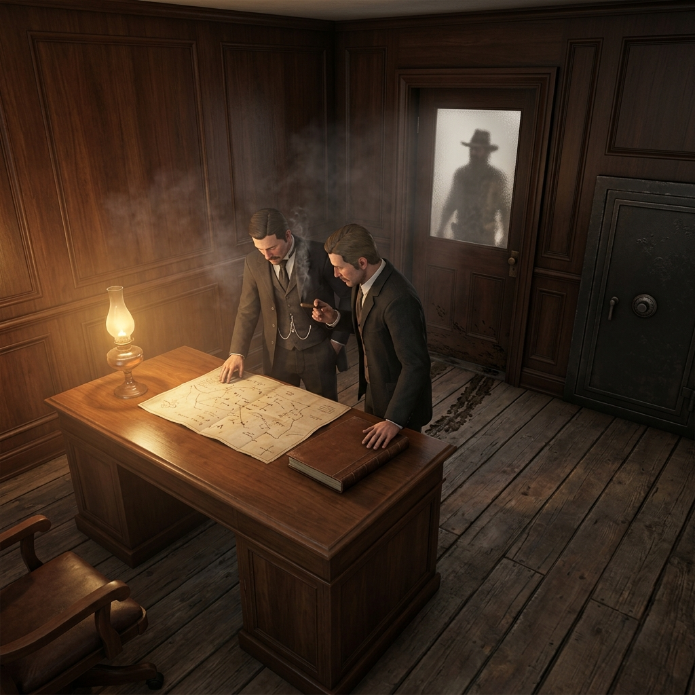

## Claim Kings and Combine Men

> *"Office of the Recorder, Yreka District — Let it be noted that disputed filings received after the twentieth of November shall be held in trust until survey is complete. Parties presenting counter-claim without bonded witness will forfeit standing. The Recorder assumes no liability for verbal agreements made at elevation." — posted notice, torn at the corners, November 1899*

## Owners, Brokers, and Quiet Thieves

They do not dig. They do not blast. They do not sleep in wet canvas or eat cold beans with a tin spoon. But every tunnel in the district runs because a man in a clean collar said it could, and every tunnel stops when that same man says otherwise. The claim kings hold paper — patent filings, quitclaim deeds, water-right transfers, promissory notes with interest that compounds like a grudge. Some bought their first parcel honest. Most bought their second with the profit of squeezing the first. The combine men are worse in a quieter way: they pool capital from back East, name a syndicate after a river they have never seen, and send an agent with a valise and a good handshake to buy what the locals cannot afford to keep.

Between the owners and the combines stand the brokers — men who hold no dirt of their own but know every claim's weakness, every miner's debt, every wife's fear of another winter. They trade in whisper and leverage. They can make a played-out claim look rich to a buyer from Sacramento, or make a rich claim look played-out to a man who owes them money. Their offices smell like ink, lamp oil, and patience. They will pour you coffee, learn your children's names, and sign your future away before the cup is cold.

### Role

Paper holders and pressure men whose money arrives before they do and whose terms outlast their welcome.

### Traits

- Cuffs always clean, boots always dry, handshake always first offered
- Speaks of partnership while reading your debts from a pocket ledger
- Keeps a private road, a private store, or a private lawman — sometimes all three
- Donates publicly to the church fund and privately to the man who sets fires

### Trail Work

#### The Quiet Filing

A claim king never contests your title in the street. He contests it at the county seat, on a Tuesday, when he knows you are forty miles up a creek with no horse. The filing is clean. The signature is witnessed. By the time you hear about it, the burden of proof has changed hands. His lawyer will explain this to you slowly, as though teaching a child.

#### The Grubstake Collar

He offers grubstake to a broke miner — flour, powder, steel, maybe even a new pair of boots — and the terms seem fair until the assay comes in. Then the interest shifts, the repayment schedule tightens, and the miner discovers he has been working his own claim as someone else's employee for six weeks. The paper was clear. The miner just did not read it twice.

#### The Bought Witness

When a boundary dispute reaches the recorder's office, testimony matters. A claim king keeps two or three men on quiet retainer — not gunslingers, just fellows with sober faces who remember property lines the way they are told to remember them. They will swear on a Bible and look a judge in the eye, and they will do it for less than you would think.

#### The Company Store Lock

He builds a store at the mouth of the gulch and prices flour ten cents above Yreka rate. Then he buys the only wagon road and charges toll. A miner can walk eighteen miles on a deer trail to save a dime on salt pork, or he can pay the man's price and owe the man's store. By December, half the camp trades in scrip that is only good at one counter. The chain is made of convenience, and it locks without a sound.

#### The Proxy Badge

The combine man does not hire thugs. He hires a deputy. He pays the county a fee, suggests a reliable candidate, and suddenly the law in the gulch works for whoever pays its salary. The deputy is polite. He follows procedure. He enforces ordinances that were written last month by a man who owns six claims and a hotel. If you object, you are objecting to the law, and that is a different kind of trouble.

#### The Charitable Squeeze

He donates lumber for the schoolhouse. He pays the doctor's rent for a year. He brings a piano up from Redding for the church social. And now every family in town owes him something that cannot be measured in dollars — a debt of gratitude that makes it very hard to testify against his water-right filing or complain about his mill dumping tailings in the creek. Generosity, properly applied, is the cheapest fence ever built.

#### The Survey That Moved

A claim king hires a surveyor — his surveyor — to re-run the lines on a disputed parcel. The new stakes come back fourteen feet east of where the old ones stood, and suddenly your shaft house is on his side of the property. You can hire your own surveyor, if you can find one who is not already working for him, and if you can pay his fee, and if the recorder will accept a second survey after the first one has already been filed. Each "if" costs money you do not have.

#### The Polite Ultimatum

He invites you to dinner. Actual dinner — roast beef, good wine, a tablecloth that has never seen a mining camp. Over dessert he explains that he would like to buy your claim for a fair price, and he names a number that is half what it is worth and twice what you could get from anyone else, because he has made sure no one else is buying. He is sorry about that. He shakes your hand and says the offer stands until Friday. On Saturday, his lawyer files the contest.

#### The Road That Closed

A public road crosses his land, or land he says is his. One morning there is a gate. A man with a rifle sits beside it, not threatening, just present. He explains that the road is under repair, or that the title is in dispute, or that the county never formally established right-of-way. All of these things may be true. The effect is the same: your ore does not move, your supplies do not arrive, and the clock on your grubstake loan keeps ticking. The road will reopen when the matter is settled. The matter will be settled when you sell.

#### The Long Winter Offer

He waits. That is his greatest weapon, and it costs him nothing. He waits through the dry summer when your sluice runs empty. He waits through the cave-in that takes your best shaft. He waits through the fever that puts your partner in the ground and your children in borrowed beds. Then he comes with paper and a pen and a price that would have insulted you in April but looks like salvation in November. He is not cruel. He is simply the last man standing with money, and winter does his negotiating for him.

### Camp Say

> *"Don't hate the man with the ledger. He ain't the storm. He's just the fellow who owns the only roof — and he'll rent it to you, sure. Read the terms, is all. Read the terms, and count your fingers after you shake."*

— meaning: the danger is not violence but agreement, and the trap is not cruelty but contract
