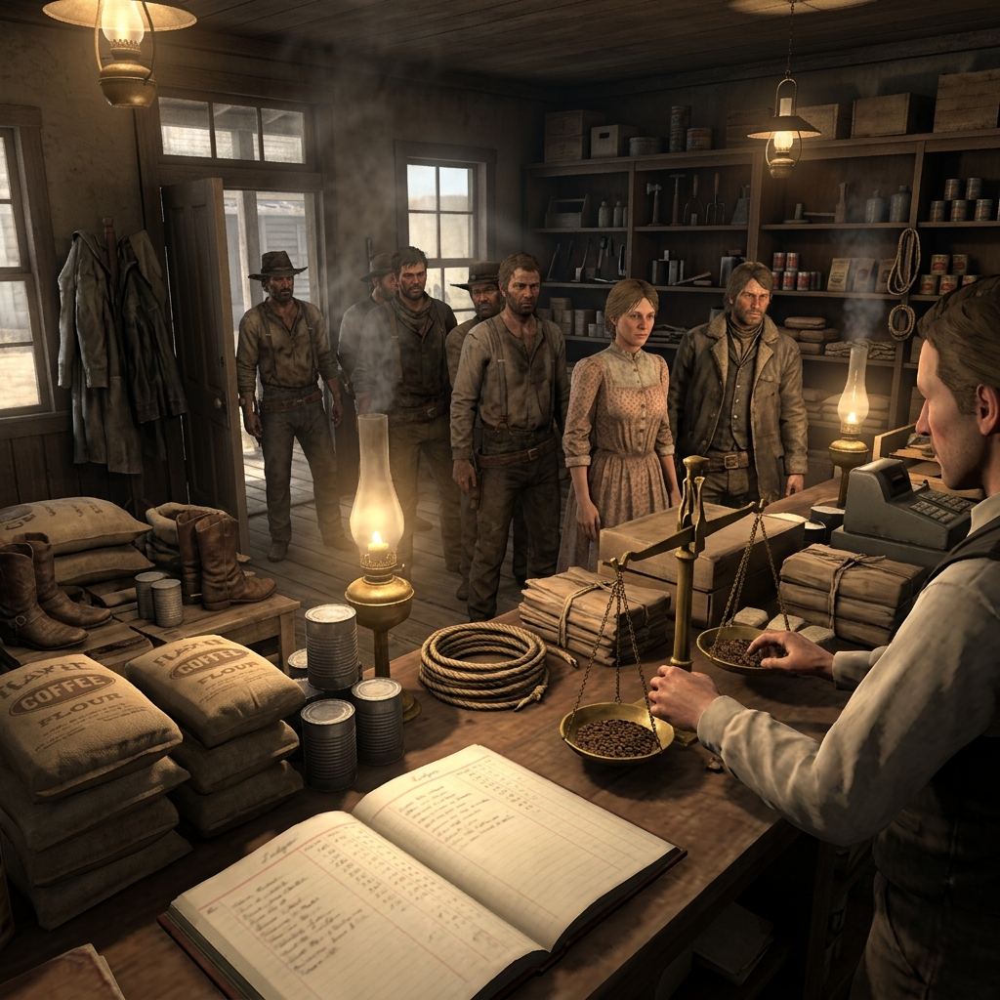

## Company Store Clerks

> *"Account carried forward. Interest noted. Balance due at company discretion. —Stamp on every third page of the Jefferson Mercantile ledger, 1897"*

## Ledger Counter Men and Women

They stand behind plank counters stacked with tinned beef, blasting powder, boot nails, and patent medicine, and they write down everything. Every sack of flour advanced on payday promise, every dime shaved off a miner's wage before it reaches his hand, every substitution of cheap tallow for the lard that was ordered. The company store clerk is not a shopkeeper. A shopkeeper sells goods. A clerk sells time—yours, specifically, the weeks and months you will spend working off what you already owe.

In a camp where coin is scarce and the nearest independent merchant is forty miles of bad road away, the person behind the counter holds a quiet empire. They know who drinks, who sends money home, who cannot read the figures written next to their name. They know which foreman's wife gets the good coffee and which widow gets the weeviled flour. They extend credit with a pleasant nod and collect it with a pencil mark that says you owe another month of labor. A store clerk never needs to raise a fist. The ledger does the holding.

### Role

The clerk who counts what you owe and decides what you get.

### Traits

- Keeps a pencil behind the ear and a second one hidden, sharpened differently, for the other book
- Remembers every face that ever asked for credit and the exact tone they used when asking
- Smells of coal oil, brown paper, and the vinegar used to wipe the counter every closing hour
- Speaks in round numbers and short sentences when money is discussed, but talks freely about weather and neighbors

### Trail Work

#### The Carried Balance

Offer credit to someone who cannot refuse it. The debt is small today. Name the interest only if asked directly, and even then, round it down so it sounds fair. The trap is not the amount—it is that the borrower must return to this counter and no other.

#### The Pencil and the Ghost

Change a number in the ledger. A seven becomes a nine, a crossed-out line reappears. The alteration need not be large. When the account holder questions it, show patience and read the figures aloud as though the mistake were theirs. If they press the matter, suggest they take it up with the superintendent.

#### The Empty Shelf

Remove an item from sale—not from the storeroom, only from the shelf. Blasting caps, quinine, writing paper, cartridges. When someone asks for it, explain the shipment has not arrived. Decide privately who learns that the item is, in fact, available through the back door and at what additional cost or favor.

#### The Substitution

Fill an order with something close but lesser. Corn meal for wheat flour. Green coffee for roasted. A half-pound tin marked as a full pound. Do it with a steady hand and a face that says the company sets the stock, not you. If caught, apologize once and offer to note a credit—on the next month's page, of course.

#### The Listening Counter

The store is the only place in camp where everyone comes. Miners, cooks, ranch women trading eggs, Native workers buying tobacco, company guards collecting their ration chits. Stand behind the counter and hear what they say to each other while they wait. Remember it. Decide later who benefits from knowing it and what that information is worth in trade.

#### The Forgiven Debt

Strike a balance clean. Tell a man or woman they owe nothing, that the company has seen fit to clear the page. Do not explain why. Let them wonder what is expected in return. The silence after forgiveness is heavier than any amount owed, and it makes the forgiven person listen very carefully the next time you ask a small favor.

#### The Ration Card

Issue supplies against a worker's name without their asking. Mark it as drawn. When they come to the counter next, inform them their balance reflects the goods already taken. If they deny receiving anything, show the ledger entry with their name and the date. Someone collected it. The question of who becomes their problem, not yours.

#### The Price That Moved

Raise the cost of one staple—coal oil, salt, tobacco, flour—by a small amount. Post no notice. When the first customer remarks on it, explain that freight costs have risen or that the supplier changed terms. The increase is modest enough that no single person will make trouble over it, but multiplied across every account in camp, it builds a wall of small debt that keeps people working past the season they planned to leave.

#### The Back-Door Sale

Sell something the company does not authorize—liquor, ammunition above the allowed count, a letter carried out of camp without passing through the company mail. Set the price high and accept payment in kind: silence, a shift traded, a word spoken to the right foreman. Keep no written record of back-door business. This is the one transaction the ledger must never show.

#### The Inventory Clue

Notice what is missing from the storeroom before anyone else does. Dynamite sticks counted wrong. Medical supplies drawn in quantities that suggest someone is hurt and hiding it, or stockpiling. A sudden run on rope, candles, or canned goods that means someone is planning to leave—or planning something worse. Decide whether to report the discrepancy to the superintendent or hold the knowledge and see who comes to the counter next with nervous hands.

### Camp Say

> *"You don't need a pistol to own a man in this country. You just need his name in your book and the only store for forty miles."*

A clerk's power is quiet, ordinary, and absolute. The person who controls the goods controls the debt, and the person who controls the debt controls the camp.
