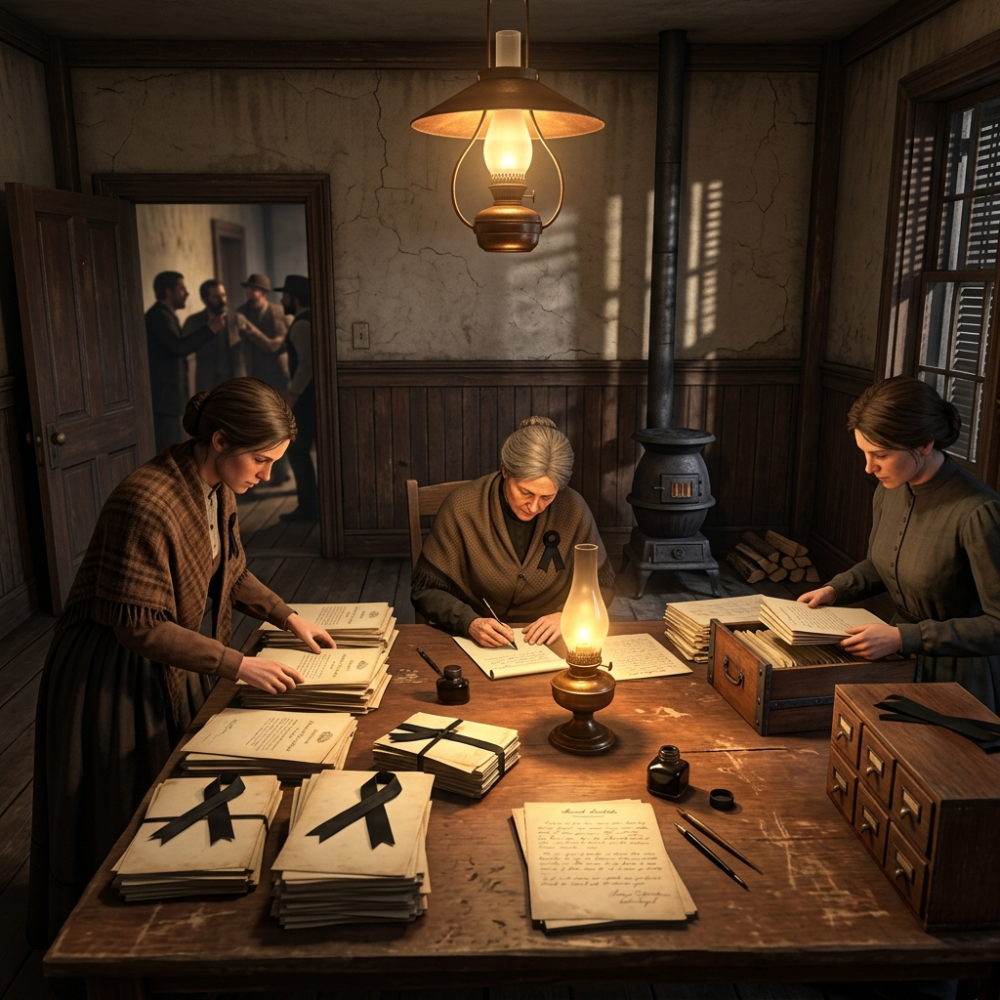

## Courthouse Memory Women

> *"Docket 411, November term, 1899—Petition to quiet title denied on grounds the widow could not produce the original deed. She produced it from her apron pocket before the clerk finished speaking. The court did not record her remarks."*

## Record Keepers and Widows

Every courthouse has a written record, and every written record has a seam where something was left out. These are the women who remember what sits in that seam. Clerks' wives who read every filing before the ink dried. Widows who watched their husbands' land get redrawn on a surveyor's table while the funeral ham was still warm. Washerwomen who carried testimony home in the same basket as the judge's shirts. Interpreters' daughters who heard what was said and what was put down, and know the distance between the two.

They do not hold office. They hold memory—which in a county this young is worth more than office. A deed is paper. A woman who stood in the room when the deed was signed, who can name the witnesses and say which ones were sober, is something harder to file away. They keep the unofficial record in their kitchens, their quilting circles, their letters, and their silences. Some of them are kind. Some of them are tired past kindness into something more useful. None of them forget.

### Role

Bearers of unofficial testimony, domestic intelligence, and the memory the courthouse did not commit to paper.

### Traits

- Reads a legal filing the way a butcher reads a carcass—looking for where the weight was trimmed.
- Keeps a black dress clean and ready, not from grief alone but because funerals are where men talk freely.
- Folds the day's work with hands that do not shake, even when the day's work included a lie told under oath.
- Quotes dates, names, and sums the way other women quote Scripture—from long practice and personal need.

### Trail Work

#### Produce the Missing Document

Pull a deed, letter, or witness statement from private keeping that contradicts the official file. The paper is real. The question is whether anyone will accept it from your hand, and what you will owe the person who helps you enter it into record.

#### Name the Witnesses

Recall who stood in the room when a contract was signed, a claim was filed, or a death was recorded. Name them, name their condition, and name who was turned away at the door. This is not gossip. This is testimony that never reached the stand.

#### Read the Docket Aloud

In a public setting—a store, a church supper, a trail camp—recite the details of a court action that someone hoped would stay buried in county paper. The recitation is accurate. The silence afterward belongs to the table.

#### Wash and Listen

Work in a household, a hotel, or a camp kitchen where men speak as though the help cannot hear. Carry away what you heard along with the linens. The intelligence is good, but using it means explaining how you came by it, and that explanation has a cost.

#### Attend the Funeral

Appear at a burial or mourning-house where grief loosens tongues and old debts surface. Learn who owes what to whom, which land is now unspoken for, and which promises died with the deceased. Funerals are public. What you do with what you learn there is not.

#### Challenge a Filing

Present yourself at the clerk's window and dispute a record—a land transfer, a marriage date, a debt amount—on the strength of your own memory and whatever paper you carry. The clerk may correct the file. The clerk may also remember your face the next time you need something from that window.

#### Shelter and Obligate

Take someone in—a traveler, a woman put out, a child with nowhere—and in doing so, create a debt that is not written down but is understood by everyone at the table. Kindness is real. Kindness that someone owes you for is a different instrument entirely.

#### Shame in Company

At a gathering where reputation matters, say plainly what a man did—what he signed, what he denied, what he took from someone who could not stop him. Say it without raising your voice. The room will do the rest, or it will not, and either way you have spent something that does not come back.

#### Interpret Between Parties

Stand between two people—or two peoples—who do not share a language, a legal standing, or a reason to trust each other, and carry meaning in both directions. What you choose to translate exactly and what you choose to soften is the real power, and the real danger.

#### Keep the Ledger No One Asked For

Maintain a private record—births, deaths, debts, land changes, who came and who left—in a notebook, a letter box, or your own recall. When the county's books are burned, lost, or simply wrong, yours is what remains. That makes you useful. It also makes you a target for anyone whose version of events depends on the county's books being the only ones.

### Camp Say

> *"I have buried two husbands and outlived one courthouse fire. I can tell you what was in every drawer. Whether you want to hear it is your own affair."*
