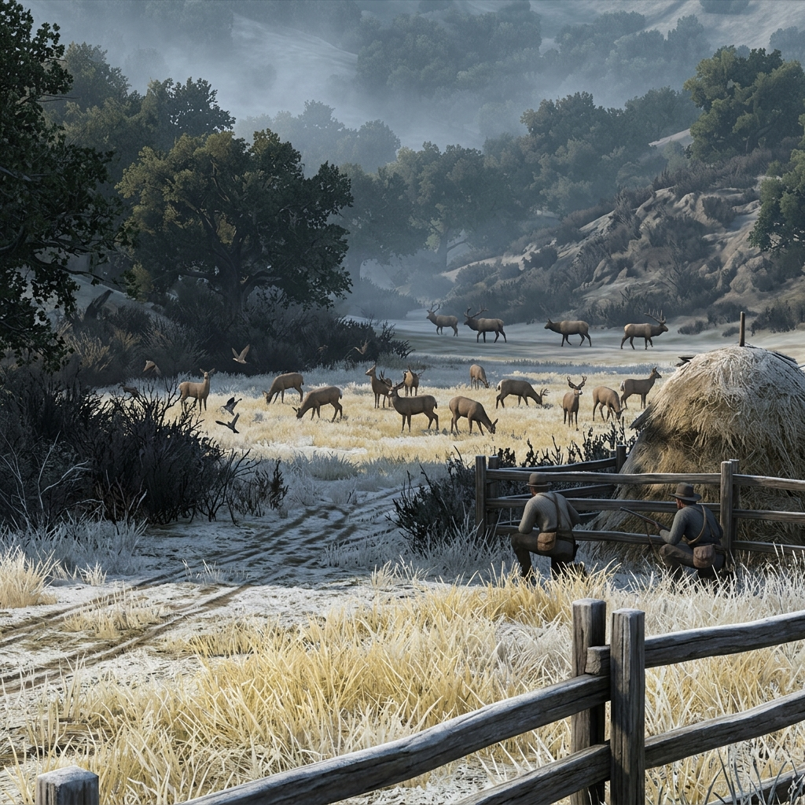

## Elk and Deer Herds

> *"Count the beds in the meadow grass before you count the antlers. The number that slept there tells you more than the number still standing."*

## Meat, Tracks, and Winter Warnings

The deer and elk of Jefferson's high country are not decoration. They are two hundred pounds of winter survival on the hoof, and every camp, cabin, tribal band, and ranch crew within forty miles knows exactly where they bed, where they water, and when they move. A blacktail herd browsing the oak flats in October means the creeks are still running and the acorns dropped heavy. Elk bunching along the river meadows before first frost means the high passes have already closed and the cold is coming early. When the herds shift, everything that eats shifts with them—cougar, wolf, bear, and men with empty larders.

But the herds are not what they were. Market hunters cleaned out whole valleys in the eighties. Railroad camps took elk by the wagonload and left the offal to rot. Tribal hunting grounds that fed families for generations are now fenced ranch land, and the new state game laws say a Klamath man needs a license to feed his own children on land his grandfather never left. The herds that remain are contested, pressured, and watched—by predators, by hunger, and by men who do not agree on who has the right to kill.

### Role

Living measure of the country's health—food supply, storm sign, predator draw, and proof of who holds the land and who goes hungry.

### Traits

- **They move before the weather turns.** Elk will abandon a high meadow two days before a storm a man cannot yet smell. If the herd is already in the river bottom in early November, winter is ahead of the calendar.
- **Tracks tell stories longer than the animal.** A deer trail trampled wide and fresh means the herd is bunched and nervous—something is pushing them. A trail gone cold and overgrown means the feed gave out or something already killed through.
- **A full meadow draws everything with teeth.** Where thirty elk bed down, a cougar is hunting the edges within the week. Where deer yard up in a willow bottom, wolves will find them before Christmas.
- **Meat shared is a bond. Meat hoarded is a war.** In hard country, who you feed and who you don't is remembered longer than who you shot.

### Signs and Pressures

#### The Meadow That's Too Full

A valley holding more elk than it should means something pushed them off higher ground—fire, wolves, or early snow. The grass will not last. In three weeks the meadow will be mud and the herd will be starving or scattered. Plenty now is a warning, not a gift.

#### The Empty Trail

A game trail that was heavy with sign last month and now shows nothing means the herd moved or died. Follow the old tracks out and read what you find. If there are drag marks and cougar scat at the end, you have a predator working the area. If the trail just fades into nothing, the feed failed and the deer went somewhere you haven't found yet.

#### The Doe and Fawns in December

Late fawns still spotted in December mean a doe bred late, and late fawns rarely survive a hard winter. But a camp that is starving will kill what it can reach. Shooting a doe with fawns at heel feeds you tonight and costs you three deer next year. Everyone at the table knows this, and some of them are hungry enough not to care.

#### The Bull Elk at the Salt Lick

A big bull standing alone at a mineral lick in autumn is not a trophy—he is an animal whose body is breaking down after the rut. He is thin, his neck is swollen, and his meat will taste of musk. He is also the breeding stock for next year's calves. Kill him and the herd loses its strongest blood. Let him walk and he may not survive the winter anyway. There is no clean choice.

#### The Market Hunter's Wagon

Someone is running elk hides and dried venison down the freight road to Yreka. Legally, the new game statutes forbid commercial sale of wild game. Practically, the man with the wagon has a family and the hides bring four dollars each. Reporting him brings the game warden. Ignoring him means the herd keeps shrinking. Buying from him makes you complicit. He will be back next week regardless.

#### The Tribal Hunting Camp

A Shasta or Klamath camp is set up on the old hunting ground—land that is now legally a cattle lease. They have been hunting this drainage since before anyone in town had a grandfather on this continent. The rancher wants them off. The game warden says they need a license. The hunters say the deer were here before the fence and so were they. Nobody is wrong and nobody is going to back down easily.

#### The Herd in the Hay Field

Elk have broken through a rancher's fence and are eating winter hay meant for cattle. Every bale they eat is a bale the cattle will not have in February. The rancher wants to shoot them. The game law says he cannot without a permit. The elk do not read statutes. If the hay runs out, cattle die in March and the rancher loses his place. If the elk are shot, the drainage loses its herd and the venison that kept three families alive last winter.

#### The Kill Site at the Creek

Fresh gut pile at the water's edge, maybe a day old. Someone dressed an elk here and packed out the quarters. No hide, no head—just offal and blood in the water. Downstream, someone's cabin draws drinking water from this creek. The kill may be legal, may not. The mess will draw bears to the water, and the fouled creek will push deer off this drainage for weeks. A clean hunter buries the offal away from water. This one didn't.

#### The Deer Yarded Up Before the Storm

Thirty blacktail packed into a willow thicket, not feeding, not moving—just standing. When deer yard up like that in early winter, a killing storm is less than two days out. The deer know before the sky shows it. A wise camp looks at the herd and starts cutting firewood instead of planning a hunt. The meat will still be there after the storm, if you are still alive to take it.

#### The Herd That Won't Spook

A band of deer that does not run when you approach has either never been hunted—which means you are deep in country no one visits—or has been fed by someone and now associates people with food. The first is a gift that costs nothing to leave alone. The second is a problem, because a deer that walks toward a man will walk toward a cougar, and a cougar that learns to hunt near camps will eventually stop distinguishing between deer and children.

### Camp Say

> *"We left the herd alone and ate beans for a week. Come spring, there were fawns in the meadow and we ate all summer. That is the only arithmetic that matters out here."*
