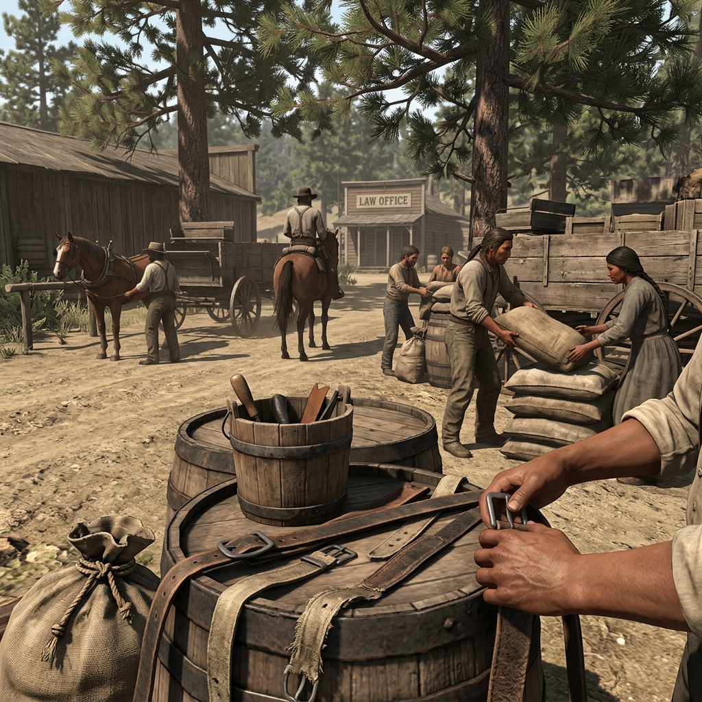

## Pit River Hands

> "They fix the axles and mend the harness, and all the while they listen. A quiet man in the yard knows more than the loud man with the warrant."

## Ridge and River Workers

In the bustling road yards of Redding and the dusty wagon stops pushing toward French Gulch, the Pit River, Wintu, and Yana-connected hands are the backbone of the region's labor. They are the riders, freight sorters, and harness repairmen who keep the county moving. Beneath the sweat of their daily work lies a fierce, enduring connection to their homelands, surviving against the weight of public prejudice and the steady creep of settlement pressure.

These families navigate the rough edges of frontier labor with quiet resilience. They trade in wagon-yard gossip, maintain extensive kin networks, and wield the quiet leverage of those who see everything. When the county demands knowledge but ignores their claims, these workers know exactly which official paper will fail first, and when to look the other way.

### Role

Laborers, riders, and yard hands leveraging quiet observation and deep kin networks.

### Traits

- Exceptional skill in animal handling, harness repair, and yard logistics.
- A vast, quiet network of kin and fellow workers across the county.
- A stoic resilience against prejudice and sudden official demands.

### Trail Work

#### Yard Gossip
Listen in while fixing a wagon to gather crucial information on a bounty hunter's route or a sheriff's plans.

#### Harness Repair
Quickly mend broken gear or rig a makeshift axle to get a stalled wagon moving before the law catches up.

#### Quiet Leverage
Use something you overheard in the livery yard to pressure a loudmouthed deputy into backing down.

#### Refusal of Service
Politely but firmly decline to shoe a horse or load a crate for a known enemy, leaving them stranded and angry.

#### Kin Network
Send a message across the ridge through trusted cousins and workers faster than a county telegram.

#### Road Knowledge
Recall the exact condition of a back trail or washed-out bridge, guiding allies safely through the dark.

#### Family Protection
Hide a wanted person or stolen goods within the busy machinery of a freight yard, daring the law to search every crate.

#### Witness Scene
Step forward to provide a crucial, undeniable account of a road incident, shifting the blame away from your kin.

#### Local Accountability
Call out a broken deal in front of the whole yard, forcing a cheating foreman to pay what is owed or face a strike.

#### Watching the Paper
Identify a forged warrant or a flawed county claim just by looking at how the ink was stamped.

### Camp Say

> "You can own the wagon, but you still need my hands to make the wheel turn."
