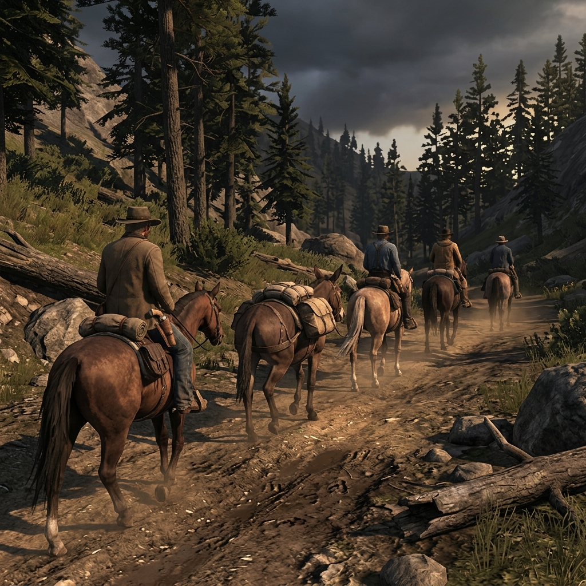

## Rangers and Trailhands

> *"Packed the mule wrong this morning and lost a hundred pounds of flour to the Applegate crossing. Country don't forgive arithmetic mistakes."*
> — Trail note found in a tin box, Siskiyou freight camp, 1897

## Big-Country Working Riders

Rangers and trailhands are the people who keep the routes breathing. They are not explorers and they are not conquerors. They are working riders who know that a trail is not a line on paper but a living negotiation between weather, livestock, terrain, and the stubbornness of whoever paid for the trip. A trailhand may ride deputy for a county ranger one season and push cattle for a stockman the next. What holds them together is road knowledge — the practical kind that tells you where the ford washes out in March, which meadow has enough graze for thirty head, and how far a sick horse can go before you are carrying the saddle yourself.

They do not own the country they cross. The routes belong to the people who live along them — the ranchers who tolerate passage, the families who maintain the water stops, the freighters who wore the ruts in. A trailhand's authority is borrowed and temporary, measured in competence rather than title. He earns his place by getting people, animals, and cargo where they need to be, and he loses it the first time he acts like the road was built for him.

### Role

Keeps the party moving, the animals sound, and the camp fed across country that does not care who you are.

### Traits

- Checks the horses before he checks the coffee
- Sleeps light and wakes with the wind shift
- Carries two knives, one for rope and one for everything else
- Knows the difference between a shortcut and a burial ground

### Trail Work

#### Read the Country

Study a stretch of ground for water, graze, shelter, and trouble before the party commits to it. You will miss things — the question is whether what you miss kills time or kills stock.

#### Tend the String

Keep the horses and mules fit, fed, watered, and properly shod. A lame mount on day three means someone walks on day four, and walkers slow everything down to the speed of a blister.

#### Set Camp Right

Choose ground that drains, blocks wind, and sits close enough to water without inviting whatever comes to drink at night. A bad camp costs a full day of rest to recover from.

#### Ration the Stores

Track the food, the ammunition, the matches, the medical supplies. Cut portions early if the arithmetic says you are three days longer than the flour. Nobody thanks you for it, but nobody starves either.

#### Read Weather Coming

Watch the cloud line, the wind backing, the way the animals hold their ears. You cannot stop a storm but you can get the canvas up and the stock hobbled before it hits, and the difference between ready and surprised is somebody's life.

#### Track What Passed

Read sign on the trail — how many riders, how long ago, whether they were hurrying. This is not detective work. This is knowing whether the road ahead is empty, occupied, or recently abandoned for a reason you have not figured out yet.

#### Mend the Route

Clear deadfall, mark a washed-out ford, stack rock where the trail forks wrong. You are not building a road. You are keeping an agreement between travelers that the next person through will not ride off a cliff in the dark.

#### Settle Camp Disputes

When two drovers argue over watch rotation or a freighter blames the cook for the coffee, step in before it turns into something that needs a doctor. Your authority here is practical, not legal — you are right only as long as people believe the trip matters more than the grudge.

#### Handle Animal Trouble

Deal with a cougar circling the stock, a rattlesnake in the bedroll, a bear on the trail. This does not mean shooting everything that moves. Sometimes it means moving the camp. Sometimes it means noise. Sometimes it means admitting the animal was here first and the trail goes around.

#### Get the Straggler Home

When someone falls behind — sick, injured, lost, or just slower than the country demands — decide whether to split the party, slow the whole group, or send a rider back. Every answer costs something. The wrong one costs more.

#### Witness and Report

When you find a body, a burned wagon, a claim stake in disputed ground, your job is to remember it accurately and tell it straight to whoever needs to know. A trailhand's word carries weight exactly because he has no stake in the outcome — lose that and you are just another liar on horseback.

#### Spare-Mount Arithmetic

Manage the remuda so there is always a fresh horse when one goes lame and a pack animal when cargo shifts. Run out of spares and the whole operation moves at the speed of the weakest leg. This is not glamorous work, but it is the difference between a trip and a disaster.

### Camp Say

> *"Any fool can find the trail in good weather. Trailhand earns his keep on the day the trail finds him."*
>
> Meaning: the real work starts when the plan breaks down, and the people who handle that moment are the ones worth hiring.
