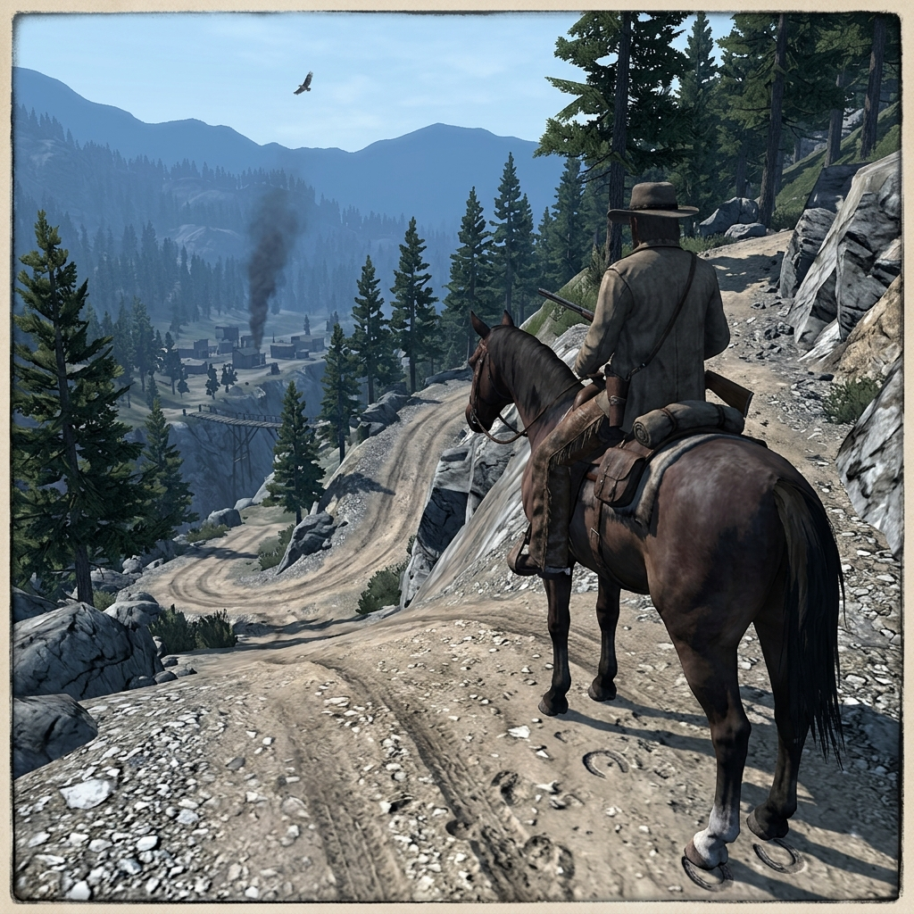

## Road Scouts

> *"If the jays go quiet and the dust hangs wrong, turn your horse. You will not outrun what shut the birds up."*

## Ahead-Riders

The road scout leaves camp before anyone else is awake and comes back with news nobody wants to hear. He rides ahead of the freight wagons, the stage, the family rigs, and the ore trains to test what the road has become since the last man traveled it. Washouts, fallen timber, bridge rot, ambush sign, flooded creek approaches, and settlements that have gone unfriendly — the scout finds it all and rides back to say how much it will cost to go forward.

They are hired by stage lines and claim bosses, by families moving households and by tribal households sending word between settlements. They read grade by the labor of their horse, mud by its color and smell, and a quiet town by the speed at which the curtains close. A good scout saves lives. A tired scout, a drunk scout, or a scout carrying bad information can lose a whole party to a canyon road that is no longer there.

### Role

Advance route judgment, threat assessment, and passage-cost estimation for travelers, freight, and families.

### Traits

- **First one saddled, last one thanked.** The scout's report decides the day, but the driver gets the credit for arriving alive.
- **Reads mud like a newspaper.** Color, depth, and the angle of the ruts tell the scout how recently a road was traveled, by what, and whether the bottom will hold.
- **Carries twice the worry and half the supplies.** A scout rides light and fast, which means he is always hungry and always exposed.

### Trail Work

#### Grade Test

The scout rides the worst stretch of road before the wagons attempt it — steep grades, loose rock, narrow cuts along canyon walls. He marks what will hold a loaded wagon and what will spill one. The grade does not negotiate.

#### Washout Warning

After rain, creek approaches and low road sections disappear. The scout finds where the road has gone and whether a detour exists. Sometimes the answer is to wait. Sometimes the answer is to turn back. Neither answer is popular.

#### Ambush Bend

Switchbacks and blind curves are where road agents wait. The scout reads the sign — cold fire rings, horse droppings, boot scuffs on high rock, broken branches at rifle height — and decides whether the road is watched.

#### False Trail

Not every path that looks like a road leads somewhere useful. The scout distinguishes between a traveled route and a logger's dead end, a cattle track that fades into brush, or a shortcut that saves a mile and costs an axle.

#### Dust Reading

A column of dust on a far ridge tells the scout that riders are moving. The color, height, and drift of the dust suggest how many, how fast, and whether they are driving stock or riding empty. Dust does not lie, but it does not explain itself either.

#### Town Quiet

When a settlement goes still before a stranger arrives — shutters closing, dogs called in, no smoke from the smithy — the scout knows something has happened or is about to. Reading a quiet town is harder than reading a hostile one.

#### Bridge Test

The scout dismounts and walks a bridge before the wagons cross. He checks the timbers, the supports, the nail heads, and the way the planks give underfoot. A bridge that held last month may not hold today, and the creek below does not care about schedules.

#### Night Push

When the party must travel after dark — fleeing trouble, meeting a deadline, or racing weather — the scout rides ahead with a lantern or by starlight. Every rock and rut is a guess. Fatigue makes liars out of experienced men.

#### Local Passage

Some roads cross land where the owners expect to be asked. The scout who rides through without word causes trouble for everyone behind him. Knowing whom to ask, what to offer, and when to wait is as important as knowing the grade.

#### Supply Count

The scout estimates how far the party can travel on what they carry — water, grain, food, axle grease, spare wheels. If the numbers do not work, the scout must say so before the road makes the arithmetic worse.

### Camp Say

> *"I have never found a road that was better than the last man said. I have found plenty that were worse. My job is to tell you the cost before the hill does."*
>
> — The scout does not promise a safe road. He promises an honest count of what the road will take.
