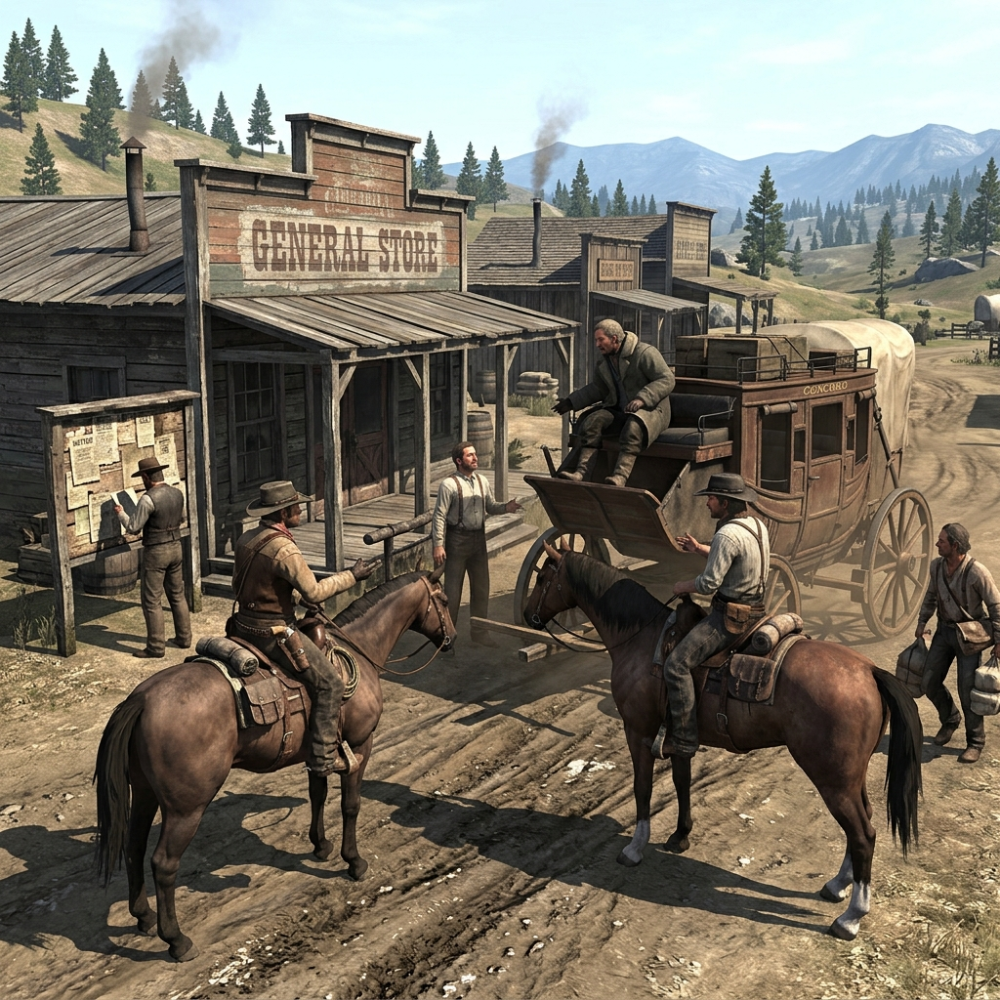

## The Rumor Road

> *A notch on the lintel, a penny left heads-up, a half-smoked cigar balanced on a fence post.*
>
> Nobody sends the news. The news sends itself, carried by every driver, drifter, and cook who owes somebody a name.
>
> — Chalk mark found on a boarding-house door frame, French Gulch, 1899

## Living Gossip Network

The Rumor Road is not a place on any surveyor's map. It is the current that runs beneath every handshake at a freight dock, every whispered warning behind a saloon stove, every letter folded into a mail pouch with a coin pressed on top for haste. In the country around French Gulch, where a single winter slide can cut a settlement off from the county seat for weeks, word of mouth is infrastructure. Whoever controls what is believed controls what is done.

Those who walk the Rumor Road do not hold office or carry warrants. They hold favors. They remember which packer's daughter married which miner's creditor. They know that the road through Whiskeytown runs soft after October, that the assay office in Shasta weighs light on Thursdays, and that the company foreman drinks before he signs. The road is invisible because it is everywhere, running through every camp kitchen, livery stable, and courthouse step between Clear Creek and the Klamath.

### Role

**The web of talk, favor, debt, and remembered route that moves faster than any rider.**

### Traits

- **Long Memory** — Every name heard is a name kept. Debts, grudges, kinships, and promises are filed away like courthouse paper and recalled when leverage is needed.
- **Light Feet** — The road's people move between camps, towns, and factions without belonging to any of them. Welcome everywhere; trusted nowhere completely.
- **Coin of Gossip** — Information is currency. A scrap of knowledge about a payroll, a warrant, or a claim dispute is worth more than gold dust to the right ear.
- **Thread-Puller** — Those who carry rumor also shape it. A word placed carefully at a boarding-house table can start a run on a mine, empty a camp, or send a posse down the wrong ridge.

### Gifts

#### Told You So

When a rumor you planted earlier proves true — or true enough — you may invoke the weight of your reputation. Those present recall that you warned them, and your next piece of counsel carries the force of demonstrated foresight. Useful for swaying town meetings, calming panicked miners, or turning a skeptical sheriff your direction.

#### Penny Post

You can pass a message to any named person within a day's ride without being seen delivering it yourself. The message moves through a chain of small debts: a bartender who owes you for silence, a stable boy who wants his name kept out of a fight, a packer's wife who needs someone to carry a letter the other direction. The message arrives, but the chain is fragile — any one link could be leaned on.

#### Back-Trail Whisper

When you arrive in a settlement, you already know one thing the locals wish you did not: a recent arrest, a missing shipment, a name on a warrant, or a debt come due. You heard it on the road before anyone thought to hide it. This knowledge is yours to use, trade, or sit on.

#### Smoke Signal

You can spread a false rumor through a camp or settlement. The rumor takes hold over the course of a day and is believed by most who hear it — until someone with firsthand knowledge contradicts it. Once contradicted, the lie burns back toward you. Useful but dangerous; every false smoke signal makes the next true message harder to sell.

#### Favor Owed

You may call in a standing debt from a named contact in any settlement you have visited before. The favor is small — a night's shelter, a hidden horse, a name whispered, a door left unlocked — but it is reliable. Once called, the debt is spent. New debts must be earned through play.

#### Road Memory

You recall the condition of a specific road, ford, trail, or pass from your last crossing. You know whether the creek was high, where the slide took the path, whether the bridge timbers looked rotten, and who was camped at the crossing. This memory is reliable for recent seasons but fades after a hard winter or a spring flood.

#### Ear to the Ground

When you spend an evening in a saloon, boarding house, or camp kitchen, you overhear one piece of local trouble that has not yet become common knowledge. This may be a debt dispute, a claim jump in progress, a warrant being prepared, or a supply shipment that will not arrive. The information is raw and may be incomplete.

#### Safe House

You know a place — a root cellar, an abandoned claim shack, a hay loft, a widow's back room — where a person can hide for a day and a night without being found by casual search. The safe house is real, but it has a cost: whoever owns the space may ask a favor in return, and using the same hiding place twice risks exposure.

#### Name Drop

By invoking the name of someone powerful, feared, or respected — whether they actually sent you or not — you can open a door that would otherwise stay shut. A foreman's name gets you past a company gate. A sheriff's name buys an extra hour before questions start. A claim king's name makes a clerk move faster. But if the named party learns you used their weight without permission, the debt comes due hard.

#### Cut the Wire

You can sever a line of communication — intercept a letter, delay a telegraph message, misdirect a courier, or ensure a warning arrives too late. The disruption lasts one day at most, and the message will eventually reach its destination by another route. But one day of silence is sometimes all a plan needs.

### Working Cant

> *A coin on the post means the road is listening. If the coin is gone by morning, someone already answered.*
