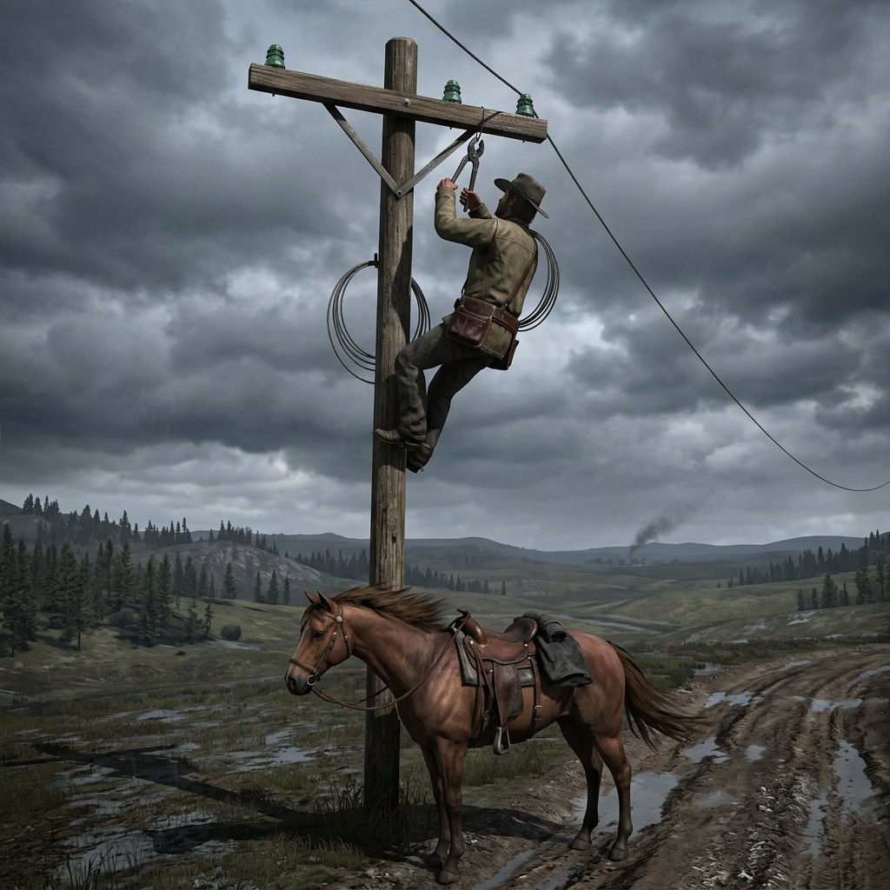

## Wire Riders

> *Line break reported between Relay 7 and the Sawyer Creek crossing. Cause unknown. No traffic south of the divide since Tuesday last. Rider dispatched. — Field note, Jefferson Telegraph & Signal Co., March 1899*

## Telegraph Line Riders

They ride the wire road when the messages stop. Every mile of copper strand between the relay offices belongs to weather, to rot, to whoever owns a good pair of pliers and a reason to keep a town quiet. The wire-rider carries a saddlebag of splicing tools, a notebook of relay codes, and the uncomfortable knowledge that the first person to read a message decides who else hears it. In Jefferson State, where the nearest railroad spur is still a rumor and the post takes eleven days, the telegraph line is the only thing faster than a horse. When it goes silent, the rider goes out — and what he finds at the break tells him more than the message ever would.

They are not operators. They do not sit behind a desk and tap brass. They ride fence-post to fence-post across open country, glass insulators glinting in the rain, and they fix what broke or they report what was cut. Some of them carry dispatches in plain English. Some carry them in cipher. All of them know that a dead line is not the same as an empty one, and that silence, in the right county, is worth more than gold.

### Role

Repair, relay, and decide who hears the news first.

### Traits

- Hands scarred from bare wire and cold pliers, knuckles split in dry weather
- Reads a broken insulator the way a tracker reads a heel-print — what hit it, when, and from which direction
- Talks little in town but remembers every word said at a relay station
- Keeps a second notebook no one has seen

### Trail Work

#### The Splice

Repair a downed line under pressure — bad weather, hostile ground, or a sender waiting at the far office. The fix holds or it doesn't, and either way someone is watching the road behind you.

#### Dead Drop

Leave a message at a relay station for a specific rider or operator, bypassing the official log. The note exists outside the record. If it's found by the wrong hands, there is no explaining it.

#### Cut Reading

Examine a break in the wire and determine whether it fell to weather, rot, or a deliberate cut. The answer shapes what you report — and to whom. A clean cut with pliers looks nothing like a branch-fall, but saying so out loud has consequences.

#### Coded Urgency

Send or receive a message using a private cipher agreed upon between two parties. The relay operator sees the text but cannot read it. This works until the operator decides he ought to try.

#### Relay Station Trouble

Arrive at a relay office to find it closed, abandoned, or occupied by someone who should not be there. The equipment may be intact. The logbook may be missing. What you do next determines whether the line reopens or stays dark.

#### Wet Saddle

Ride through foul weather to reach a line break before the next shift. The horse is tired, the wire road is mud, and the glass insulators are fogged or cracked by hail. You arrive soaked and cold, and the work still has to be done with numb fingers.

#### Intercepted Dispatch

A message passes through your hands — or through a station you trust — and its contents change the stakes for someone at the table. You can deliver it whole, deliver it late, lose it in the mud, or remember it and never write it down.

#### Who Gets Told First

You carry news that matters — a warrant, a death, a price, a lie. The order in which people hear it reshapes the ground. The first to know has time to move. The last to know has time to blame you.

#### Dead Battery

The relay office battery jars are spent or frozen. No current, no signal, no traffic until someone rides fresh acid or dry cells from the nearest supply point. In the meantime, the line is open but silent, and anyone listening hears nothing — which is its own kind of message.

#### Pole Work

A section of poles is down — toppled by wind, by cattle, by a logging crew that didn't care, or by someone who cared very much. Resetting poles is slow, heavy labor that leaves you exposed on open ground for hours. You can do it right or you can string a temporary ground-line and ride on, but the temporary fix fails first in the next storm.

### Camp Say

> *"The wire can outrun any horse in Jefferson, but it cannot tell you who cut it, and it cannot tell you whether the man at the other end is reading your words aloud to a room full of strangers. Fix the line, send the message, and ride before the answer comes back. Some news is better delivered by a man who is already gone."*

A wire-rider does not own the truth. He carries it, and what he does between the break and the office is the only freedom the job affords.
