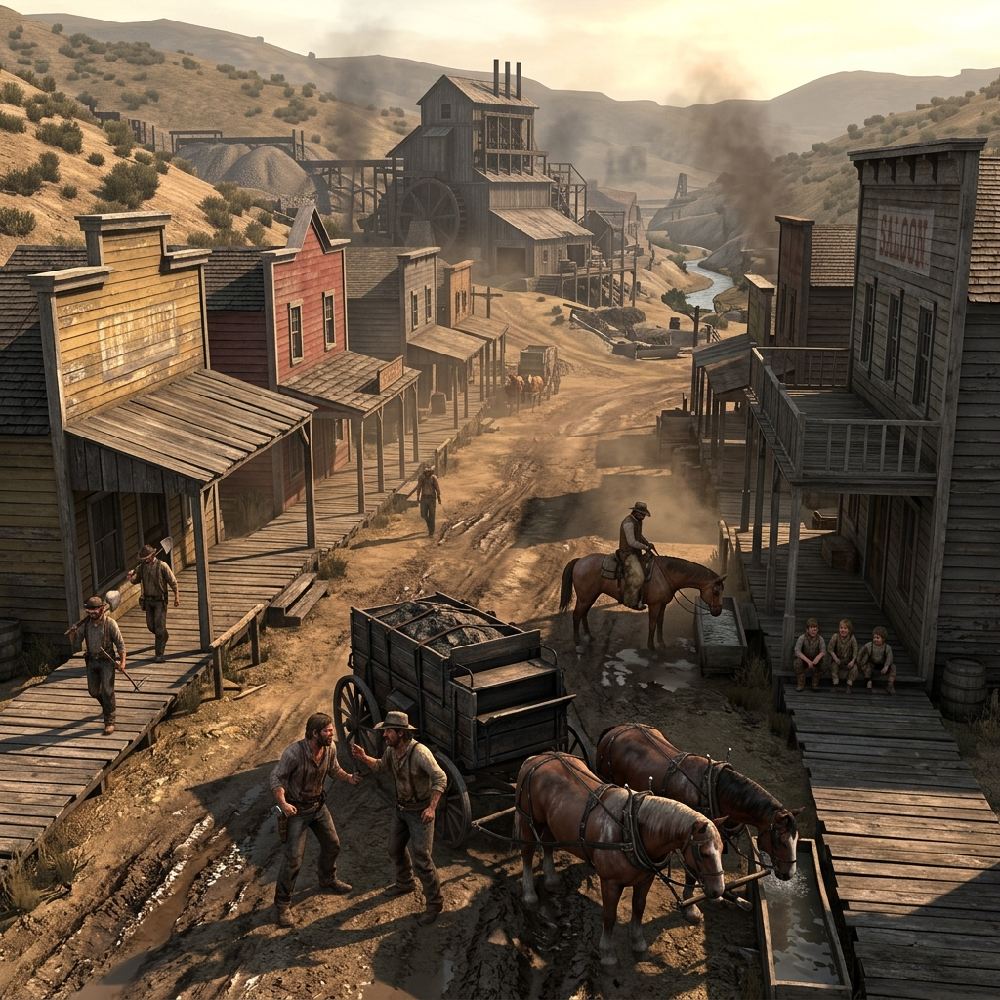

## French Gulch

### In the Register of Stamp Mill, Creek Bed, and Main Street

> An ore cart wheel rusted to its axle beside the mill steps, too heavy to steal and too broken to use.
> Creek mud climbs the boardwalk pilings after every rain, and the stamp mill answers with a thump that shakes dust from the rafters.
> Everybody in the gulch came for something, and most of them are still paying for the trip.

French Gulch is a mining settlement that grew from a creek-bottom camp into a town of boarding rooms, saloons, a stamp mill, a company office, and enough bad credit to keep every man in it working past the point of profit. The stamp mill runs day and night, and its thump carries through the walls of every building on Main Street like a second heartbeat nobody asked for. Ore wagons churn the road from the claims to the mill, and the teamsters who drive them drink at the saloon before they are paid for the haul. Wages owed sit on the company ledger alongside claim arguments, boarding debts, and the cost of cartridges bought against next week's pay. Travelers pass through and are watched; the town decides what they want before they say it. Native families trade at the edges, and nobody pretends the arrangement is fair. At night, animals nose through the refuse behind the saloons, and the creek gives up whatever the rain loosens from the hillside—sometimes gravel, sometimes a tool, sometimes something that answers a question nobody asked out loud.

The town is useful and it knows its price. Every service carries a witness: the barber hears confessions, the boarding-house keeper counts who sleeps where and who does not come home, the saloon-keeper extends credit that turns into obligation. Law papers arrive by road and are read aloud at the company office, where men stand in the mud and learn whether the claim they have been working belongs to them or to someone who filed first in Shasta. The creek bed is picked over and picked over again, and the men who work it smell of wet timber, whiskey, mule sweat, hot iron, lamp smoke, and the rot that comes from water that has passed through too many sluice boxes. French Gulch does not invite; it tolerates, and the toll is paid in labor, in silence, or in leaving.

### Field Mark

> Where the boardwalk ends and the mud begins, listen for the stamp mill. If it has stopped, something has changed—a broken cam, a labor dispute, a body found in the drift. The silence is the scene, and the town is already deciding who to blame.
