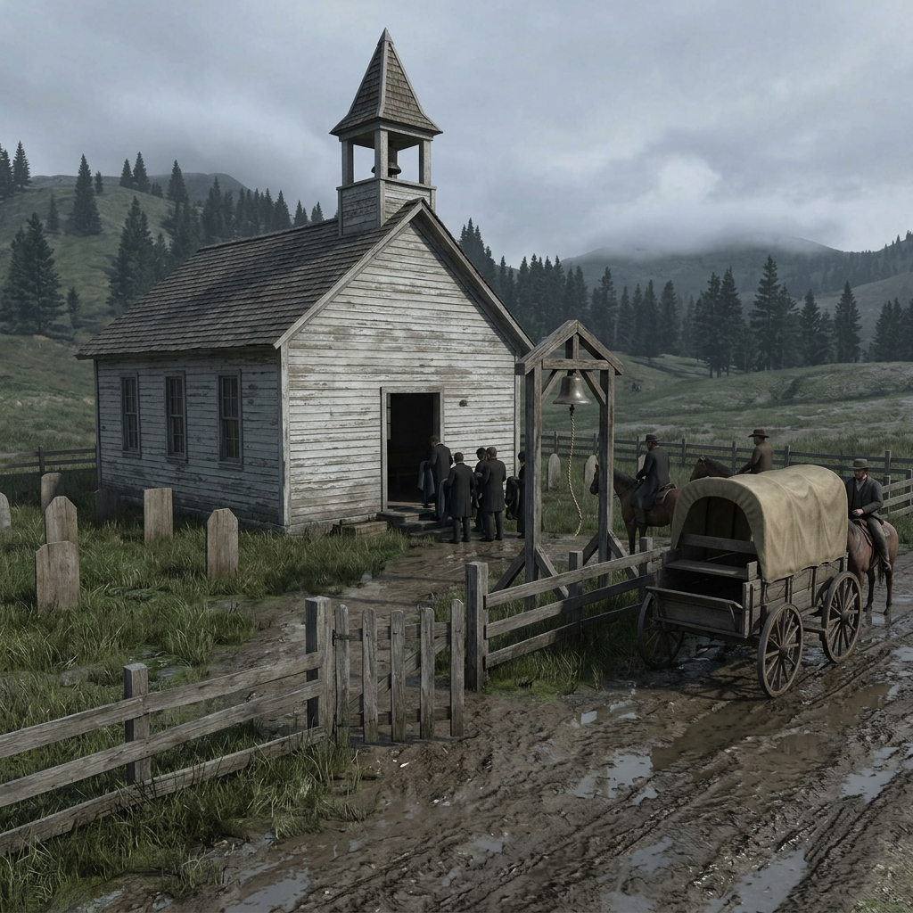

## Mission-Church Yards

### In the Register of Bell Rope, Grave Fence, and Borrowed Shelter

> A bell rope worn smooth where hands have pulled it for reasons the congregation does not discuss.
> Rain pools against the newest grave fence, and the mud has not yet settled.
> Public mercy and public memory argue under the same roof.

The churchyard sits where the road bends toward respectability, though respectability is a thin coat of whitewash on old boards. Graves crowd the fence line in uneven rows—some marked with cut stone, most with painted wood that the weather takes a little more from every season. The names that matter are carved deep; the names that do not are scratched in pencil or left off entirely. Funerals bring the town together, but they also bring the town's arguments into the open: who deserves a prayer read aloud, who gets a borrowed blanket on the porch when the night turns cold, who is fed from the meal basket and who is fed from the door around back where fewer people watch. Charity here is real, but it has a memory, and the yard keeps a quiet account of who gave and who received and who refused both.

Shelter at the church is offered but not promised. A traveler with a cough may sleep under the bell frame; a family burned out of a claim cabin may sit in the yard until someone decides what to do with them. The bell itself rings for death, for fire, for trouble on the road—and when it rings without explanation, the town comes to the yard to learn what happened before anyone tells them. Cultural tension sits in the ground itself: older burials lie under newer fences, and there are names the preacher knows but does not read from the register. The yard is peaceful until someone reads the newest board, and then it becomes the place where the town must decide, in public, what it owes.

### Field Mark

> Where the grave fence leans and the bell rope hangs within reach of the porch, count the fresh boards. If the newest name is not one the town expected, the yard is already holding a scene—and shelter will cost more than a blanket tonight.
