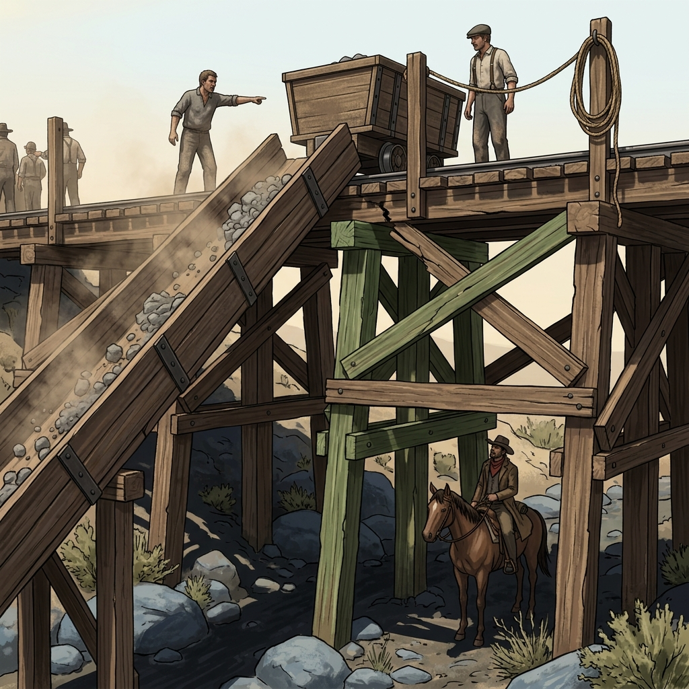

## Ore Trestles

### In the Register of High Timber, Chute Dust, and Loose Bolt

> A green-timber brace bowed under a loaded car, iron bolts weeping rust down the crossbeam.
> Ore dust hangs in the chute throat like fog that never lifts, and every board talks when a man steps wrong.
> At the table, a trestle is a clock — what moves across it, what shakes loose, and who stands below when it does.

The ore trestles above French Gulch and the Whiskeytown cuts are not bridges. They are loading frames, chute decks, and raised track built from whatever timber the crew could drag uphill and spike together. Green fir stands next to sun-split pine, iron plates hammered over cracks that should have closed the line a season ago. The cars roll on narrow-gauge rail, braked by rope and lever, and the men who work the chutes know which boards flex, which bolts have backed out a quarter-turn since last month, and which braces groan loud enough to give a man time to jump. A stalled ore car on a trestle stops everything — the loading below, the mule teams waiting, the payroll schedule that depends on tonnage moving downhill. Somebody cut that brake rope, or somebody didn't check it. Either answer costs money, and the company man standing at the foot of the grade does not care which.

A trestle is high ground that nobody chose for defense. It offers a narrow path above a creek cut or a loading yard, with drop on both sides and no cover except the cars themselves and the chute walls. A man running across a trestle is visible from below and deaf to anything except ore clatter and his own boots on timber. A man hiding beneath one can hear conversations, watch for dropped cargo, and count boots without being seen. Spilled rock below the chute tells what grade the crew is pulling. A missing payroll box could be at the bottom of the ravine or in a mule pannier already a mile down the road. The dust gets into everything — eyes, coffee, lungs, the action of a pistol left open on the platform. Repairs happen fast and rough: a green beam spiked over a cracked one, a bolt driven where a bolt was never meant to go, and a foreman's word that the structure holds because it has to hold.

### Field Mark

> Where the rail timber shows fresh axe work over old splits, and ore dust coats the bolt heads so thick a man cannot tell which ones are finger-loose — that is a trestle earning its keep, and the table should ask what is rolling, what is about to give, and who profits if the whole frame drops into the cut.
