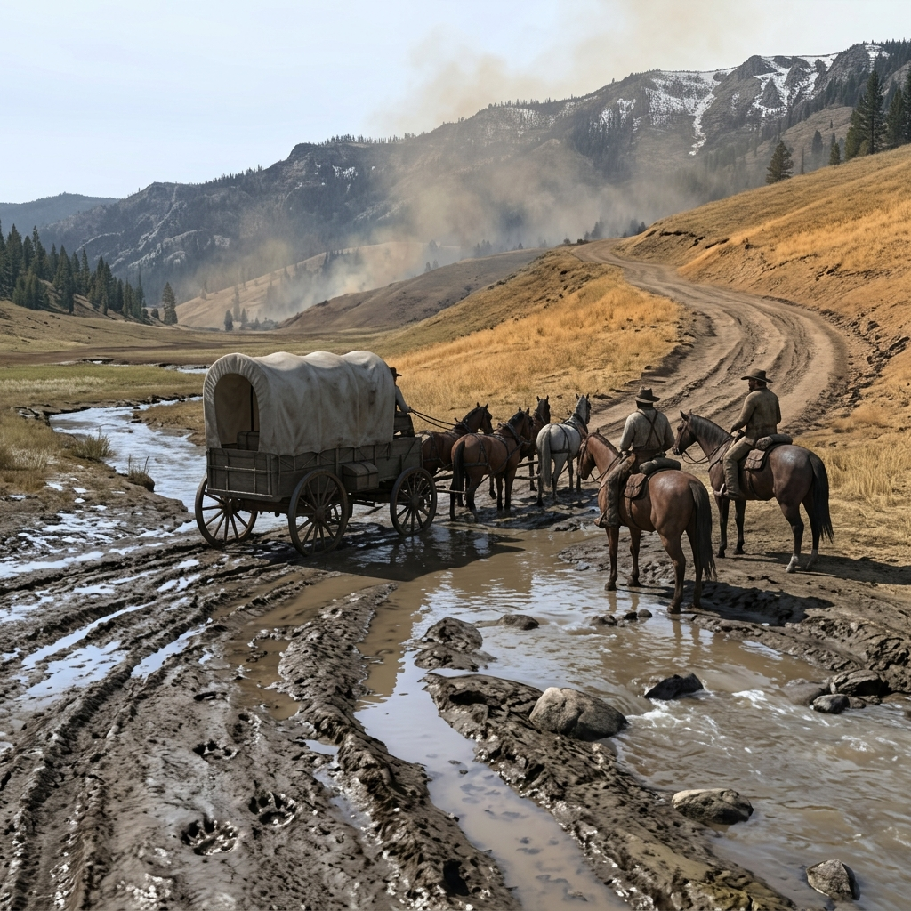

## Seasonal Shifts

### In the Register of Snow Line, Runoff, Dust, and Smoke

> The snow line dropping a hundred feet overnight, closing the high trail and pushing deer down into the creek bottoms.
> Dust rising off the Shasta road in August, thick enough to taste, and the wells drawing low enough to count.
> At the table, the season is a foreman nobody hired — it opens roads, closes passes, moves the game, and decides who eats.

Winter in Jefferson country starts with the snow line. When it drops below the high ridges, the passes close and the timber camps above three thousand feet shut down or starve. Creek crossings that were gravel bars in September become chest-deep torrents by December, and the roads between French Gulch and the outlying claims turn to the kind of mud that swallows axles. Freight slows to what a mule team can drag, and prices at the company stores climb because the men who set them know that nobody is hauling goods over the pass until spring. Deer move downhill with the snow, bunching in the creek bottoms where they are easier to find and harder to hunt without being heard by every camp within a mile. A man caught above the snow line without provisions is a man making decisions he cannot take back. Spring comes as runoff — every creek rises, every ford changes, and the snowmelt exposes whatever the winter buried: trails that shifted, trees that fell across roads, a cabin roof that gave way, or tracks that were made in autumn and preserved under ice until the thaw lays them bare for anyone with eyes.

Summer is dust and fire. The roads dry hard and fast, and the wagon traffic grinds them to powder that hangs in the air and coats everything for a quarter-mile on each side. Wells draw low. Creek flow drops to a trickle in the side drainages, and the camps that depend on spring caves start guarding their water. Timber dries to kindling, and a careless fire — a logging slash pile left smoldering, a campfire kicked apart instead of drowned — can put smoke over the whole valley in an afternoon. Fire-watch arguments start in July and do not stop until the first rain: who watches, who pays, whose slash pile sits too close to whose timber claim. Autumn is the narrow window when the roads are dry enough to travel, the creeks low enough to ford, the game moving and fattening, and the work still running before winter closes everything again. It is the season when debts come due, when payrolls are settled or stolen, when a man rides for the state line because the snow has not yet blocked the northern road. Every season changes what can be done, what costs more, what evidence survives, and who has the advantage — and the table should know what month it is before any scene begins.

### Field Mark

> Where the snow line sits against the ridge like a drawn curtain and the creek below runs brown with the first melt, or where the dust stands in the air long after the last wagon passed and the grass has gone the color of rope — that is the season making its claim, and the table should ask what just opened, what just closed, who read the weather wrong, and what the animals already know.
