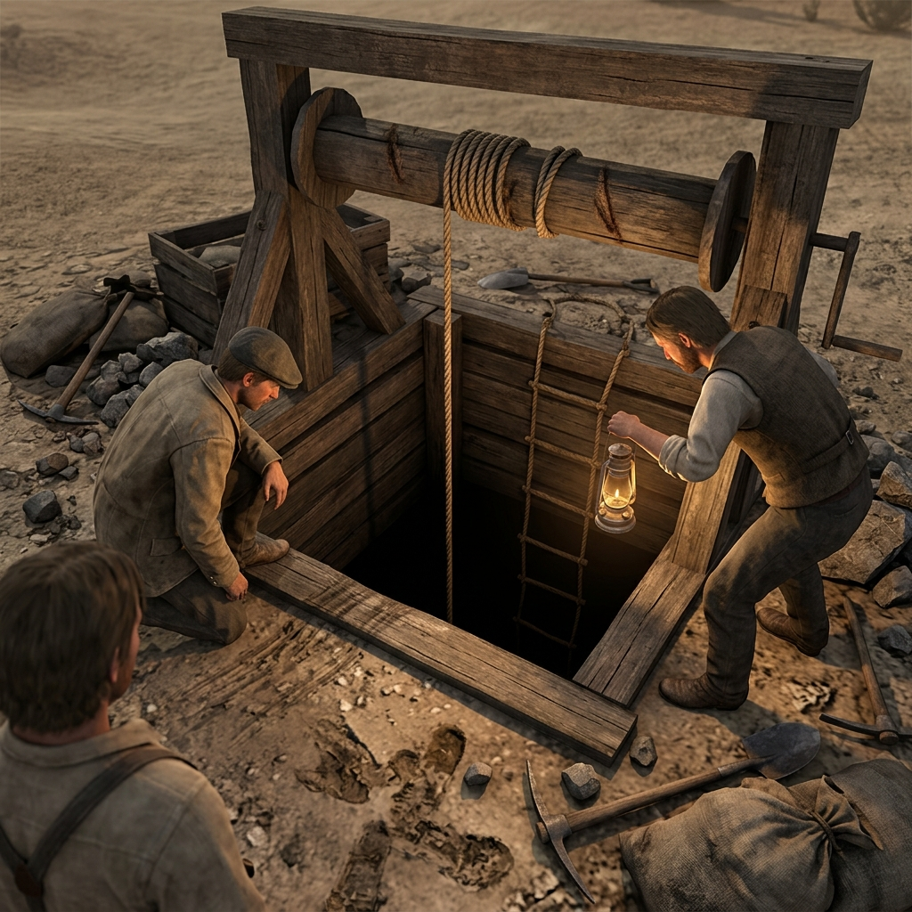

## Shaft Drops

### In the Register of Cribbed Collar, Rope Burn, and Bad Air

> A square-cut collar of notched timber at the mouth, the cribbing dark with water stain and the windlass rope frayed where it bends over the roller.
> The air rising from the shaft smells of lamp smoke and wet rock, and a pebble kicked over the edge takes long enough to hit bottom that a man stops breathing while he counts.
> At the table, a shaft drop is a hole that charges interest on every mistake — what went down, who tied the rope, and what is at the bottom that somebody wants kept there.

The shaft drops around the hard-rock claims east of French Gulch are vertical cuts into the ridge, timbered at the collar with notched cribbing and braced with whatever wood the crew could find. A windlass frame sits at the mouth — two uprights, a cross-roller, a crank handle worn smooth by use — and the rope that runs over it shows its age in every fiber. The bucket that goes down comes up heavy with rock, water, or a man who trusts the line. Rope ladders hang against the shaft wall for the miners who climb rather than ride, and the rungs are spaced by the man who built the ladder, not by any standard. Bad air sits at the bottom of deep shafts: lamp smoke that will not rise, gas that seeps from cracked rock, and a stillness that makes a candle flame lean sideways and die. A miner who feels his lamp go dim knows he has minutes to climb, not hours. Loose rock in the shaft wall calves without warning — a slab the size of a man's chest peeling away and dropping onto whoever is below. The company that owns the claim wants ore moving. The foreman who runs the crew wants the shift finished. The miner who descends on a frayed rope wants to live long enough to spend the wage he has not yet been paid.

A shaft drop is evidence storage that nobody inspects. What falls to the bottom of a worked shaft stays there unless someone lowers a lamp and a brave man to look for it: a missing payroll box, papers that should not exist, a tool with the wrong stain on it, a body that the company calls an accident and the crew calls something else. The collar of the shaft records traffic — rope wear shows use, boot scuffs on the cribbing show how many climbed and how recently, splashed mud on the windlass frame shows whether the bucket was hauled wet or dry. A rescue at a shaft drop is an argument before it is an action: who goes down, who holds the rope, whether the company pays for the time, and whether the man at the bottom is worth the risk to the man at the top. Sound carries strangely in a vertical shaft — a voice from the bottom arrives thin and directionless, and a man calling for help sounds the same as a man luring someone down. The foreman who orders work to continue while a man lies injured at the bottom of the next shaft over is making a decision the table should hear about.

### Field Mark

> Where the cribbing shows axe-cut timber dark with water stain and the windlass rope is frayed at the roller bend, and the air coming up from the dark smells of lamp smoke and something the rock will not name — that is a shaft drop earning its toll, and the table should ask who tied the last knot, who heard the fall, what sits at the bottom, and who needs the rescue to take longer than it should.
