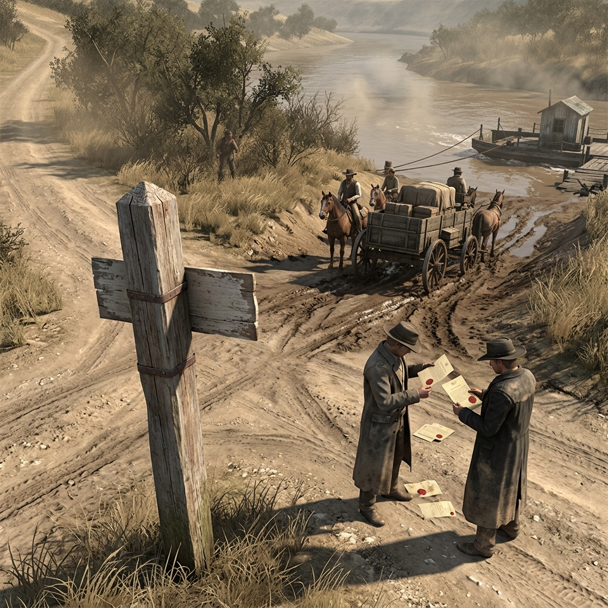

## State-Line Reaches

### In the Register of Border Post, Ferry Mud, and Folded Warrant

> A leaning post at a road fork, the paint weathered past reading and the county line it marks disputed by everyone who lives on either side.
> Ferry mud on the landing boards, boot prints overlapping in wet clay, and a folded warrant in a deputy's coat pocket that loses its force in another two miles.
> At the table, a state-line reach is a seam in the law — what works on one side does not work on the other, and the men who live in the gap know it.

The state-line reaches north of French Gulch and along the county-edge roads are not borders in any military sense. They are road forks, ferry landings, leaning posts, and creek crossings where one jurisdiction ends and another begins — or where nobody is entirely sure which jurisdiction applies. A warrant sworn out in Shasta County means nothing across the line into Siskiyou unless someone rides to the courthouse and swears it out again, and by then the man named on it is two days farther north. Deputies know where their authority stops, and the good ones stop with it; the bad ones ride past and hope nobody asks for the paper. Freight wagons carry papers that name the county of origin and the county of delivery, and a toll man at a ferry landing or a road fork can hold a wagon for hours arguing over stamps, seals, and ledger entries that may or may not match. A fugitive who understands the reaches knows exactly which creek to cross and which road fork to take, and the law behind him knows it too — the question is whether the law ahead has been told, or whether a rider can carry the word faster than a man on a tired horse.

The reaches are gossip country. News changes when it crosses a line. A rumor about payroll on the Shasta side becomes a certainty on the Siskiyou side, and a certainty about a killing becomes a rumor by the time it reaches the next ferry landing. Toll men sell route news to anyone who pays — who crossed, how many, which direction, what they were hauling, and whether they looked like men in a hurry. A deputy who needs help on the wrong side of the line must ask for it, and the man he asks can say no without consequence. Ferry rope, wet boots, axle ruts in landing mud, and the wax seal on a folded paper are the material of the reaches. The border post that marks the line may be a quarter-mile off from where the line actually falls, and the surveyor who set it is long gone. The man who knows the reaches uses that uncertainty the way a card player uses a bad shuffle — not to cheat, but to make the other man prove the deal was fair.

### Field Mark

> Where the road forks at a leaning post and the ferry mud on both landings shows boot traffic headed in every direction, and the deputy at the crossing folds his warrant a little deeper into his coat — that is a state-line reach earning its keep, and the table should ask whose law holds here, who crossed first, what paper is missing, and who profits most from the confusion.
