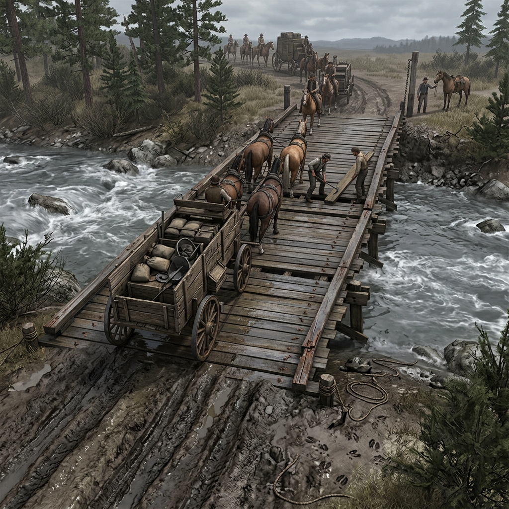

## Wagon Bridges

### In the Register of Planks, Toll Chain, and Creek Noise

> A splintered fir plank bowed under the last load, and the iron spike that held it stands bent at the rail.
> Creek foam collects against the pilings where deer tracks press into the mud bank below.
> Every crossing costs something, and the bridge remembers who paid.

A wagon bridge in Jefferson country is a chokepoint dressed in timber. It spans a creek or a gulch cut, and it decides who crosses and at what cost. The deck is fir planks spiked to log stringers, repaired in patches that tell their own history—fresh-cut boards beside gray ones, iron bolts where rope lashings used to be, a rail replaced after something heavy struck it sideways. Toll chains appear where a man with a claim to the crossing stakes his right to charge. Riders argue the fee; teamsters with loaded wagons pay because turning back costs more than the toll. Pack animals balk at the deck noise, and a mule stalled on the bridge blocks everything behind it. Rising water shifts the footing, loosens the pilings, and turns the creek below into a sound that drowns conversation. The bridge is where people meet who did not plan to meet—freight going out, freight coming in, law riding north, trouble riding south—and none of them can pass without the other stepping aside.

Bridges break, and when they break, they make news. A sabotaged bolt, a plank pulled in the night, a wagon that went through the deck and sits in the creek bed with its load scattered—each of these is a scene start and a question about who benefits from a closed crossing. Animal tracks under the bank tell who has been watering downstream. Deer sign draws hunters; hunters draw attention. A guard posted at a bridge knows every face that passes and every load that does not match its bill. Repair work is leverage: the man who fixes the bridge may charge for it, or he may simply remember who needed it fixed and when. The bridge is a handshake between two bad roads, and it holds a choice, a witness, or a bill in every plank.

### Field Mark

> Where the toll chain hangs loose and the newest plank does not match the others, check the pilings for high-water marks. If the creek has risen since the last repair, the bridge is making promises it cannot keep—and whoever owns the crossing knows it.
