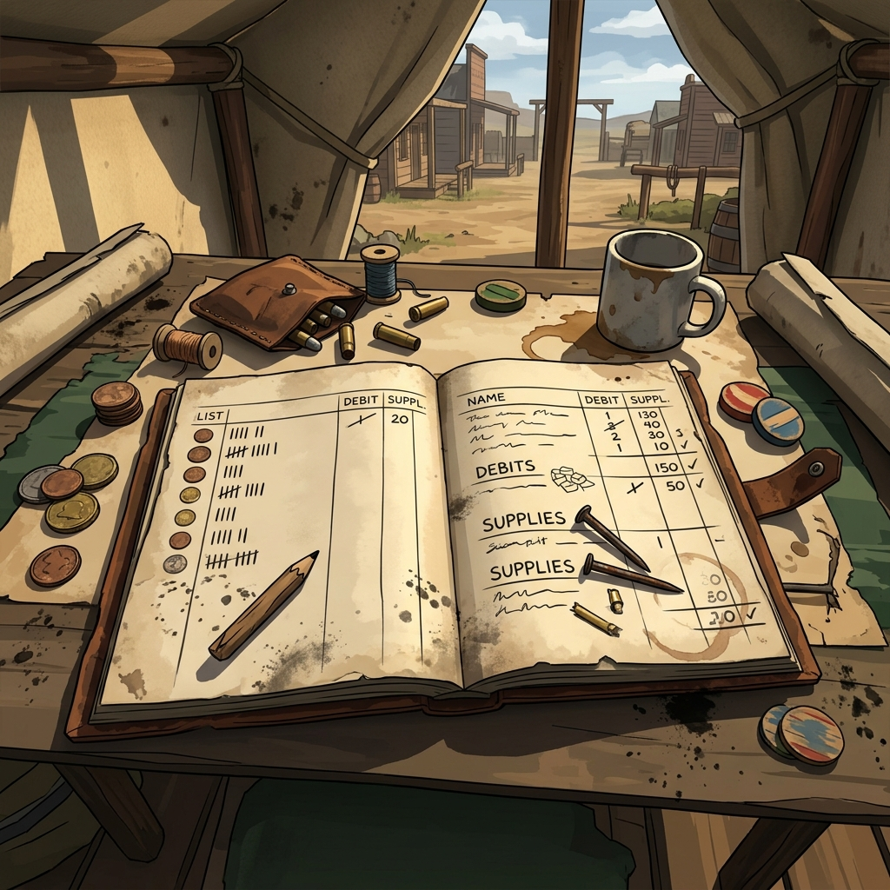

## Bookkeeping

> "A short pencil beats a long memory when the claim jumps, the creek floods, and the law stops checking the roads out of French Gulch."

Keeping the record isn't about counting every ounce of flour—it's about knowing who owes who, what's been spoken, and what the weather's washing away. Your ledger is the memory of the trail.

**Notes**  
Scratch down names you hear on the road and places that don't sit right on the map. Keep a tally of who passed through the camp, the brands you see on the cattle, and what's nailed to the assayer's door.

**Facts**  
When the dice fall or a truth is spoken flat out, write it in ink. A fact stands. If the river is out at the gulch, the river is out until the ledger says different.

**Threads**  
Draw a line between two folks or two places when trouble connects them. You hear a rumor of company men cutting fences up north? Start a thread. Follow it until it breaks or knots up tight.

**Supplies**  
Keep track of what keeps you breathing: coffee, beans, hardtack, and cartridges. Don't worry over every round in the belt, just know when the heavy sack gets light, and when it empties out entirely.

**Debts**  
Mark down what you owe and what is owed to you. A borrowed horse, a favor from the barkeep in French Gulch, or a blood debt from the ridge—debts always come due.

**Clocks**  
Draw a circle and cut it into wedges for trouble that's brewing. The company men getting closer, the storm breaking over the pass, or the sheriff putting pieces together. Darken a wedge when time slips. When the circle fills, the hammer falls.

### Margin Mark

A heavy cross in the margin means blood has been shed. A circle means the matter is settled for now, though it might surface again when the spring thaw hits. Use chalk signs to mark safe houses, dead ends, and claims gone bust.
