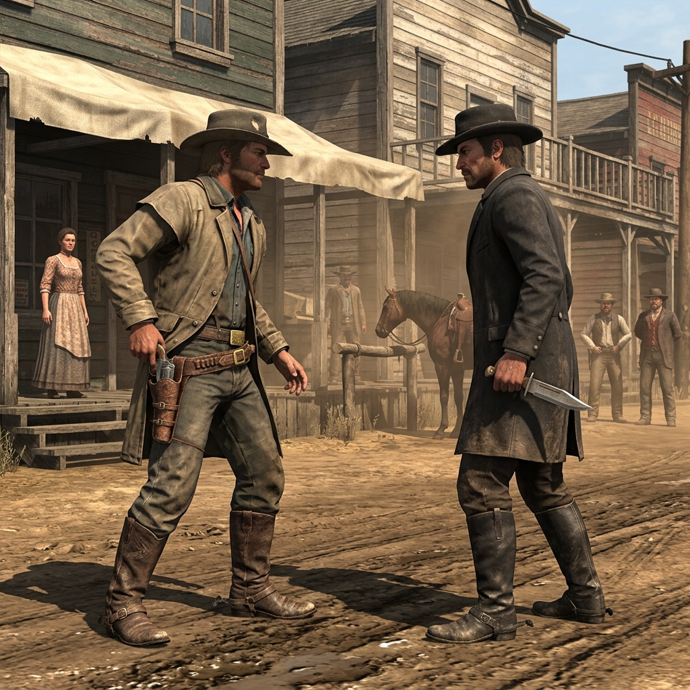

## Contest Mechanic

> "The difference between a man holding a gun and a man holding his nerve is usually decided before the hammer ever drops."

### If two characters contest

When words run dry and neither party will back down off the trail, the matter comes to a contest. This isn't about grand duels at high noon—it's the desperate scuffle in the mud, the cold stare over a crooked poker game in French Gulch, or the exhausted chase through the pines. Both sides state their intent plainly: what they want, and what they're willing to risk to get it. If the stakes are accepted, the contest is joined. Pull a card, roll the bone, or show your hand. The winner dictates the immediate outcome, but the loser decides how much it hurts.

### Hold the Line

When you are pushed, you can choose to Hold the Line. You plant your feet, grit your teeth, and refuse to give an inch, whether against a shouting rival, a locked strongbox, or a sudden winter freeze. You gain the upper hand in the contest, but you take a toll—a marked exhaustion, a broken tool, or a debt you can't easily shake. You win the moment, but the cost lingers in the ledger.

### Group Dynamics

A contest rarely stays between two souls when there's a crowd watching. When others join the fray, they don't roll separate stakes; they throw their weight behind a side. They offer an advantage—a distracting shout, a drawn blade, or the right word at the right time—but in doing so, they tie their fate to the outcome. If the contest is lost, everyone who stood with the loser shares the bitter consequence. The company men don't care who started the fight once the dust settles.

### Margin Mark

Draw a cracked line through the names of those who stood against you. It's a reminder that violence and hard words leave scars that outlast the immediate trouble. When a contest ends in blood, mark it heavily; it will bring the law, or worse, out of the gulch.
