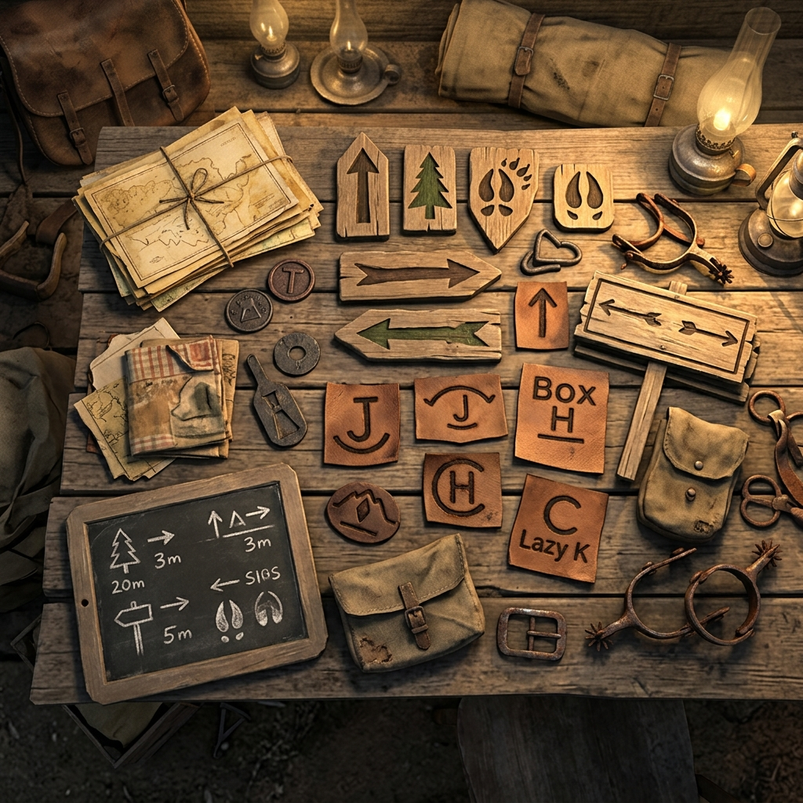

## Frontier Phrases and Trail Marks

> "The trail speaks clear enough if you know the chalk marks from the blood stains."

### Begin the Scene

When the dust settles and you need to look at what's in front of you, lay the scene out like a hand of cards. Say, **"The trail picks up at..."** and name the place and the hour. Tell us if the wind is howling off the ridge or if the air is dead still in French Gulch. Establish the footing before you take the first step.

### Ask the First Question

Before you act, look the situation in the eye and find the weak point. Say, **"What's the lay of this?"** or **"Who's holding the heavy end?"** You ask the table, and the table answers with the bare truth. No riddles. Just the facts of the ground, the mood of the room, or the shape of the danger ahead.

### Mark a Thread

When a name keeps coming up, or a piece of silver looks too familiar, you carve a notch in the ledger. Say, **"This ties back to..."** and link the new trouble to the old. A chalk mark on a fence post might mean the company is watching; a familiar brand on a stray horse might mean rustlers are working the valley. Note the connection, and let it pull tight.

### Pass the Mantle

When your part of the work is done and it's time for another to take the lead, hand over the reins. Say, **"I step back and let you take the weight."** It means your character is watching, resting, or just out of ideas. The spotlight shifts, and the next player steps up to the fire.

### Record the Fact

When a truth is settled—whether by a handshake, a gunshot, or a long fall—it becomes history. Say, **"Write it in ink."** The fact is set down in the ledger. It cannot be taken back, only dealt with. If the bridge is out, no one crosses. If the debt is paid, the slate is clean.

### Close the Scene

When the business is concluded and the daylight is gone, pack the camp. Say, **"The dust settles here."** The current action is over. Tally the costs, mark the time passed, and prepare for the next leg of the journey. The scene is closed.
