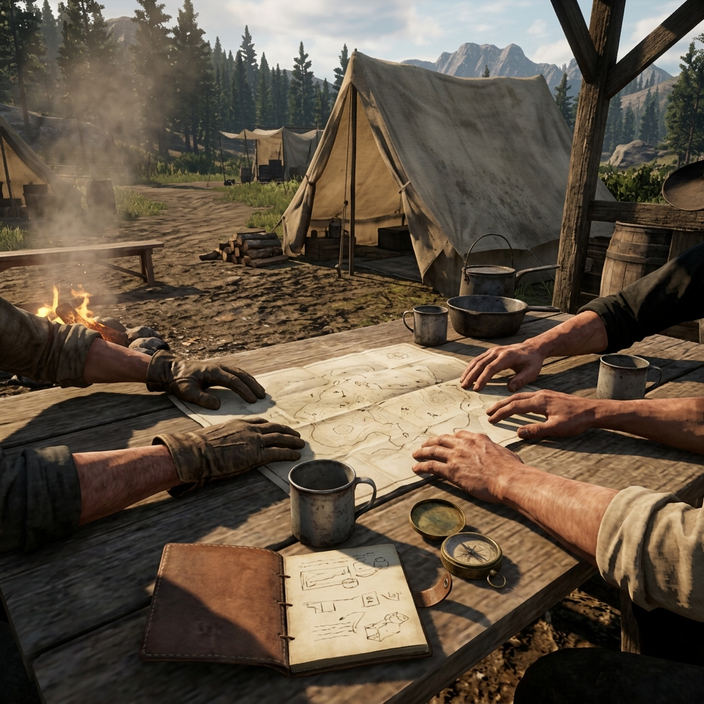

## Group Social Contract

> "Before we saddle up and ride into the dark, we agree on the trail we're taking, and we agree on who's riding with us."

### Meeting of Minds

We are here to tell a story of the 1899 Jefferson State frontier, starting out of French Gulch and heading into the hard country. This isn't a solitary ride; it's a shared camp. We hold the reins together.

**Tone of the Trail**  
We aim for the grit of the real frontier—practical, weathered, and grounded. We deal in debts, harsh weather, and hard choices. There's no glory in cheap violence, and no room for modern mockery. We keep the world feeling like dirt, wood, and iron.

**Safety in the Camp**  
The frontier is harsh, but the table is safe. If the story turns down a path that crosses a line, anyone can throw up a hand and call a halt. We use an "X-Card" or a simple, **"Hold up, let's step back."** No questions asked, no pride wounded. We reroute the trail and keep riding. We don't explore themes of sexual violence or real-world prejudice; the company men and the harsh land provide enough trouble.

**Shared Authority**  
No single person owns the whole map. We build the world together. If you describe a run-down assayer's office, the details are yours. When we face a dispute over the rules, we look to the ledger, find the fairest reading, and move on. The momentum of the ride matters more than perfect bookkeeping.

**Handling Disagreement**  
When folks disagree on what happens next, we don't shout over the fire. We state our pieces plainly, look at the odds, and let the mechanics decide. If it's a matter of the story's direction, we pause, talk it out player-to-player, and find the compromise that serves the table best.

**Ownership of the Journey**  
Every person at this table is responsible for the enjoyment of the others. Share the spotlight. Leave room for the quiet folks to speak their piece. We all suffer the rain, and we all share the coffee.

### Margin Mark

When the agreement is settled, each person marks their assent in the ledger. It's a promise to respect the camp, honor the shared story, and ride together until the journey ends.
