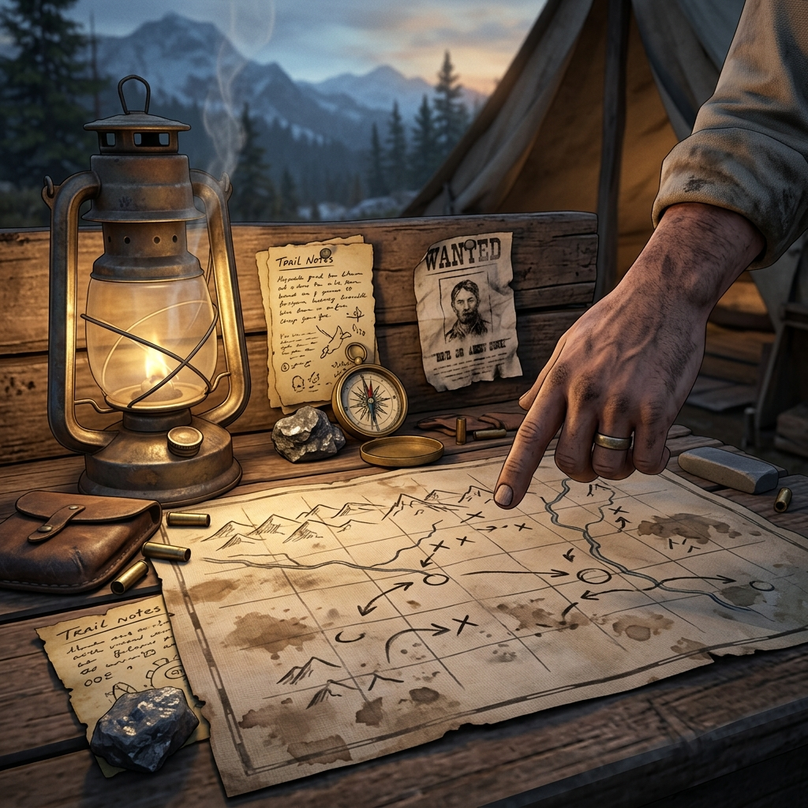

## Guidance

> *A good trail boss does not ride your horse for you. He points at the ridgeline, tells you where the creek fords are bad, and lets you pick your own way down.*

This page is for whoever holds the reins at the table — the guide, the solo player, or the group passing authority between them. Guidance is not about control. It is about knowing when to ask a question, when to let the cards decide, and when to simply describe what the weather is doing and let the silence do the rest.

In solo play, you are both the rider and the trail boss. You ask the questions and interpret the answers honestly, even when they cut against your hopes. In group play, one person may hold the guide's seat for the session, or the group may pass it scene by scene. Either way, the guide's job is the same: keep the frontier moving, keep the stakes honest, and never answer a question that the cards or the table should answer instead.

**When to speak and when to draw.** If the answer is obvious from the fiction — the bridge is out, the saloon is closed, the company man is angry — the guide simply states it. No card draw, no roll. The frontier is full of known facts. But when the answer is uncertain — *Is the rider still alive? Did the assayer lie? Will the rain hold off until morning?* — that is when you reach for the deck or the dice and let the Questioning rules decide.

**When to push and when to wait.** A scene that sits too long without a question goes stale, like coffee left on the stove. If the table falls quiet for too long, the guide's job is to introduce a small pressure: a knock on the door, a change in the weather, a debt collector walking past the window. Not a crisis — just a nudge. The frontier does not hold still, and neither should the story.

**When to end.** A scene ends when the question that opened it has been answered, or when a new question has grown large enough to demand its own scene. The guide watches for that moment — the hinge — and calls it. Fade out. Mark what was learned. Move on.

### The Oracle's Role

The oracle is not a character. It is not a spirit, a force, or a presence. It is the deck of cards, the pair of dice, or the coin on the table — a tool for answering questions when the fiction alone cannot decide. The oracle keeps the guide honest and gives the solo player someone to argue with.

When you ask the oracle a question, you are not asking for permission. You are asking for direction. The answer — yes, no, and, but — is a signpost, not a verdict. It tells you which way the trail bends. What you find around that bend is still yours to describe.

Use the oracle when:

- The outcome is genuinely uncertain and the fiction has not decided it.
- You want to be surprised by the frontier, not merely narrate it.
- Two possibilities are equally reasonable and you need the trail to fork.

Do not use the oracle when:

- The answer is already established by the fiction.
- A character's choice makes the outcome clear.
- You are stalling instead of playing.

The oracle is a hired hand, not the boss. Use it. Do not worship it.

### Margin Mark

*Penciled beneath a coffee ring: "Point at the ridge. Let them ride."*
