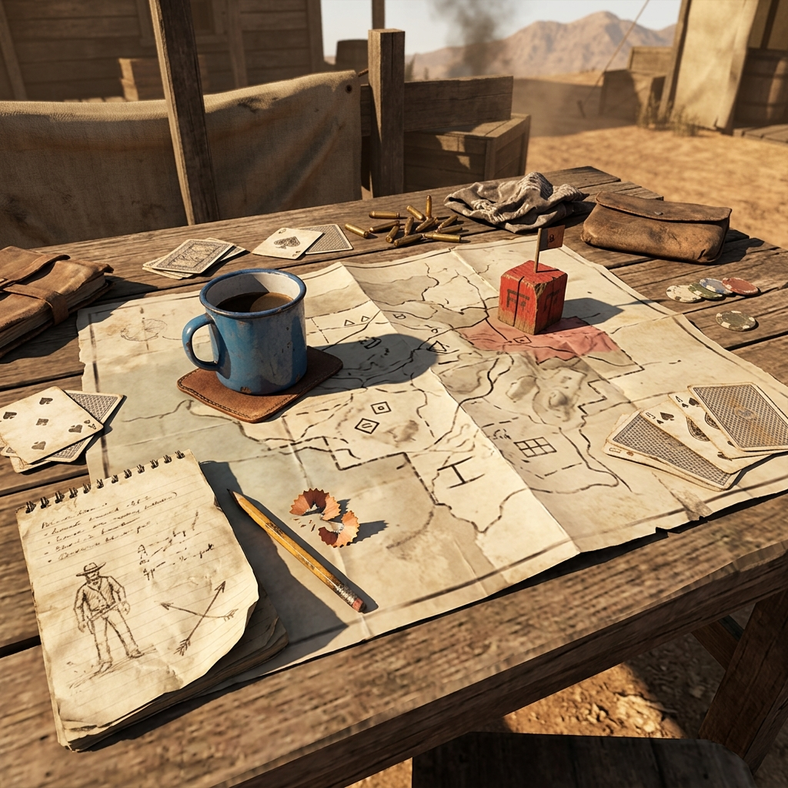

## Initialization

> *Before the first word is spoken, the table must be set. A county map, a stub pencil, a shuffled deck of playing cards, and whatever passes for coffee. That is all the frontier requires to begin.*

## ~~~

Every session of play begins the same way a prospector begins a new claim: with a patch of ground, a few known facts, and the suspicion that there is more beneath the surface.

**Set your starting place.** French Gulch sits at the junction of pressure — the company store to the north, the assay office on the main road, the creek claims running south toward Deadwood. Mark it on your map or sketch it fresh. Write down three things you can see from the porch of the boardinghouse: the weather, the nearest building with a lit window, and the road leading out of town.

**Name your people.** Each player takes a character or, in solo play, writes down one soul they intend to follow. A name, a trade, a debt, and one thing they carry that isn't worth selling. Write these on a ledger sheet or an index card. Keep them where the table can see them.

**Draw your first rumor.** Shuffle a standard deck of playing cards. Draw one card face-up and place it beside the map. This card is the first rumor — the thing folks are talking about before your character ever walks into the scene. Consult the Rumor Suit below:

| Suit     | Rumor Source         | Nature of the Talk                        |
|----------|----------------------|-------------------------------------------|
| Spades   | The company office   | Money trouble — missing wages, seized goods, or a closed account |
| Hearts   | The boardinghouse    | Somebody arrived or somebody left, and the reason matters       |
| Diamonds | The claims downstream| A strike, a theft, or a boundary dispute on the creek           |
| Clubs    | The road out of town | A rider overdue, a bridge washed out, or a stage that never came|

**Set the weather.** Roll one die or draw a second card. Odd means rain or fog. Even means dry heat or cold clear. Write the weather on the map. Weather changes when you draw a new rumor or when the fiction demands it.

**Mark your debts.** Every character in French Gulch owes somebody something. Write down who holds the debt and what form it takes — coin, labor, silence, or a favor not yet named. If you cannot think of a debt, the company store has extended credit, and they will remind you.

**Choose your first thread.** A thread is an unanswered question that pulls the story forward. Your first rumor card gives you the seed. Write the thread as a question in your ledger: *Who took the payroll satchel? Why hasn't the stage come through? What did the assayer find in the creek sample?* This thread stays open until the fiction closes it.

**Begin.** Set your pencil down, look at what you have written — a place, a person, a rumor, a debt, a question, and the weather — and step into the scene. The frontier does not wait for readiness. It only waits for you to look up from the ledger and start walking.

### Margin Mark

*A smudge of pencil lead in the margin reads: "Started with coffee and a bad map. That was enough."*
