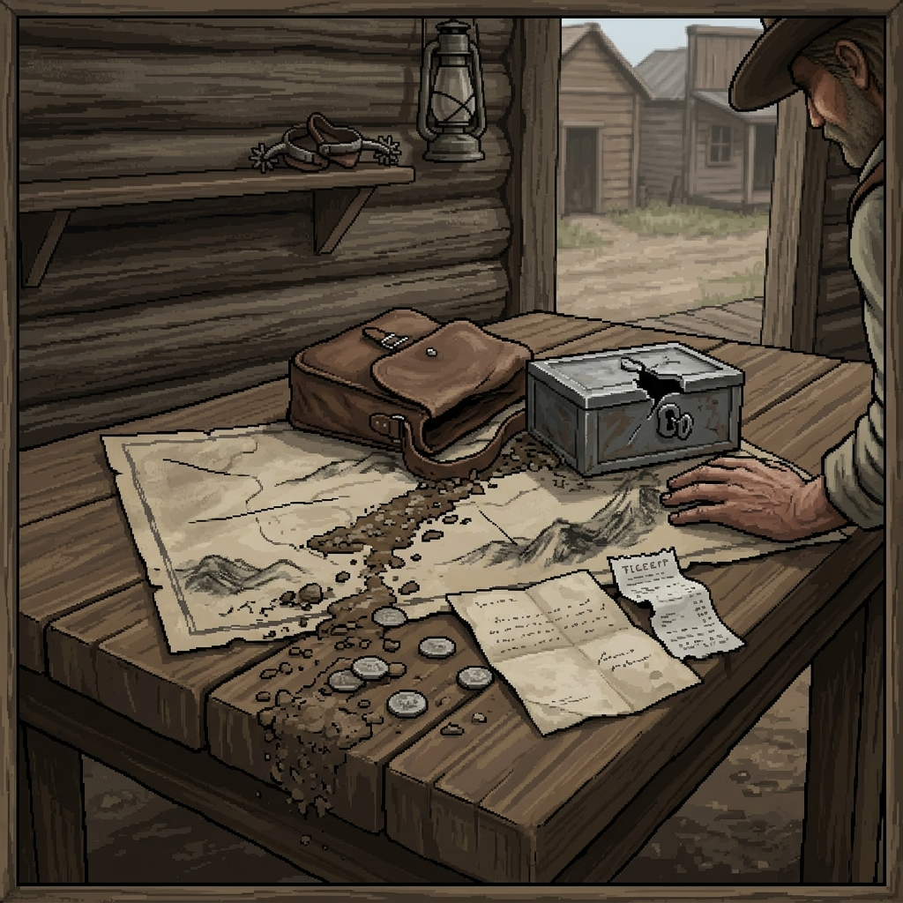

## "The French Gulch Payroll"

> "A locked strongbox is just an invitation to a man with a heavy hammer and an empty stomach."

**The Setup**  
The stagecoach bound for French Gulch rolled in three hours late, the driver bleeding from a graze on his shoulder. The strongbox carrying the logging camp's payroll was gone. You stand in the mud of the street, staring at the empty boot of the coach.

**The Question**  
You ask the table, **"What's the lay of this?"**  
*The answer comes back:* "The driver says they were hit by three men in slickers out by the narrows. But the horses aren't lathered like they ran hard, and the lock on the boot wasn't shot off—it was opened with a key."

**The Fact**  
You record a fact in the ledger: *The robbery was an inside job, or someone had a copy of the company key.*

**The Complication**  
You decide to track the coach's path back to the narrows. You call a contest to spot the trail before the rain washes it away. You pull a low card. You find the spot where the box was dropped, but the rain has turned the tracks to soup. Worse, a pair of company men on horseback appear on the ridge, looking down at you.

**The Decision**  
You don't want a gunfight with the company. You choose to **Hold the Line**, stating you'll stay hidden in the brush while they pass.

**The Consequence**  
You succeed in staying out of sight, but the cost is marked in time and comfort. You write down the condition: *Cold and soaked to the bone.* You also mark a new thread in the ledger: *Company men are searching the narrows, independently of the sheriff.*

**The Outcome**  
When they ride past, you find a small item dropped in the mud near where the strongbox lay—a receipt from the French Gulch assayer, dated yesterday. You close the scene. **"The dust settles here."** You have a direction, a cold chill in your bones, and a new target to question.

### Margin Mark

A heavy line drawn under the assayer's name. It's a reminder that the next conversation won't be friendly, and you'll need answers before the company men figure out what you already know.
