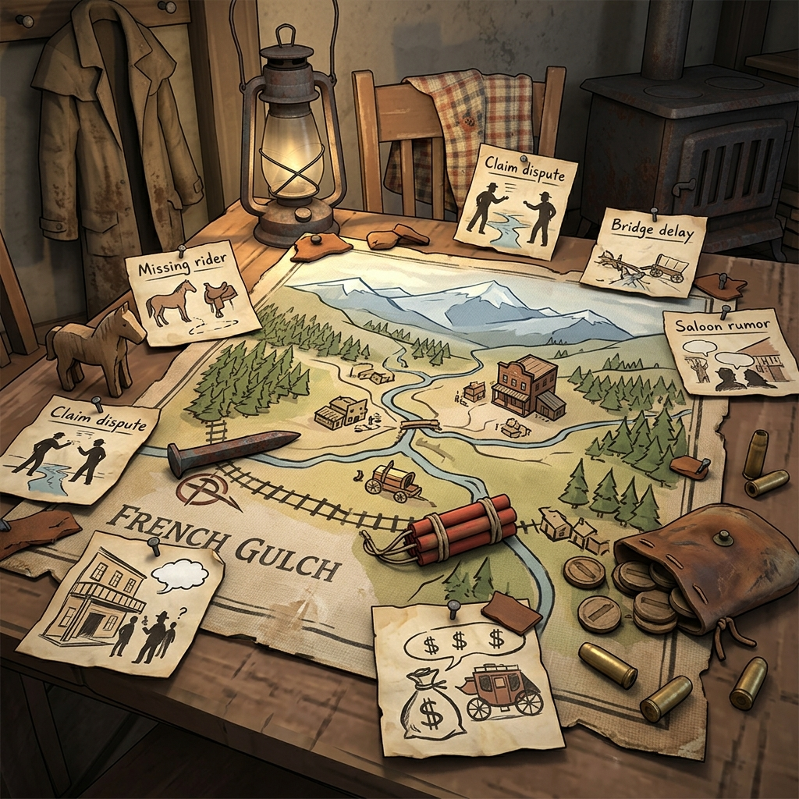

## Questioning Examples

> *The best way to learn the trail is to walk it once with somebody who has been there before. Here are five questions asked and answered in the shadow of French Gulch, so you can see how the oracle works when the dust is real.*

---

**Example One: The Missing Rider**

The stage from Redding was due at noon. It is now past sundown and no rider has come through. You ask:

*"Did the stage rider make it past the creek ford before the rain hit?"*

**Roll:** 5 — **No.**

The rider did not make it past the ford. The creek is up and the road is mud. Wherever the stage is, it is on the far side of high water. Write in your ledger: *Stage stopped at the creek ford. Creek too high to cross.* This is now a fact. The question of why the rider has not found another way around — that is a thread you can follow later.

---

**Example Two: The False Claim**

A man named Harlan Teague has filed papers on a creek claim that Amos Beckett has been working for six weeks. You ask:

*"Are Teague's claim papers filed properly at the county office?"*

**Roll:** 9 — **Yes, but...**

The papers are filed and stamped, but there is a catch. The clerk's signature is dated two days before Teague ever arrived in French Gulch — someone filed on his behalf, or the date is forged. Write the fact: *Teague's papers are filed, but the date is wrong by two days.* The "but" has cracked the door open. Who filed those papers, and why?

---

**Example Three: The Quiet Saloon**

It is Saturday night and the Dead Canary Saloon should be full of miners spending their week's wages. Instead, the place is near empty. You ask:

*"Is the saloon empty because of trouble?"*

**Roll:** 7 — **No, but...**

No trouble — at least not the kind that involves gunfire. But the miners are not here because the company posted a notice: no credit at the store for any man seen drinking before the Monday shift. The saloon is quiet because the company squeezed, not because anyone is afraid. Write the fact: *Company notice killed the Saturday crowd. No credit for drinkers.* The "but" reveals the company's reach, which is a pressure you can lean on in later scenes.

---

**Example Four: The Bridge Delay**

The wagon bridge over Clear Creek has been out for a week. The county promised a repair crew. You ask:

*"Has the repair crew arrived at the bridge site?"*

**Roll:** 3 — **No, and...**

Not only has the crew not arrived, but someone has pulled the remaining planks from the bridge and stacked them on the far bank — deliberately. The bridge is not just unrepaired; it has been further dismantled. Write the fact: *Bridge planks pulled and stacked on the far bank. Someone does not want this crossing open.* The "and" has turned a simple delay into a deliberate act. Who benefits from a closed bridge? That is a cutting question for another scene.

---

**Example Five: The Payroll Rumor**

Word around the boardinghouse is that the mining company's payroll satchel went missing between Redding and French Gulch. You ask:

*"Does the company foreman know the payroll is missing?"*

**Roll:** 10 — **Yes.**

He knows. Plain and clear. The foreman has known since yesterday morning and has said nothing to the miners. Write the fact: *Foreman knows about the missing payroll. Has not told the crew.* A clean yes is rare and useful — it establishes a firm truth. The interesting question is not whether he knows, but why he is keeping quiet. That is a thread worth pulling.

---

**Example Six: The Stranger's Horse**

A horse is tied outside the assay office that nobody recognizes — a tall bay with a brand you have never seen in this county. You ask:

*"Is the stranger inside the assay office someone from the county seat?"*

**Roll:** 12 — **Yes, and...**

The stranger is from the county seat, and he has brought a sealed envelope for the assayer — the kind with a wax stamp that means official business. The assayer has not opened it yet. He is sitting behind his counter staring at it like it might bite him. Write the fact: *County official at the assay office with a sealed letter. Assayer has not opened it.* The "and" has given you a gift: two facts for the price of one question. The stranger, the letter, and the assayer's hesitation are three hooks dangling in the same scene.

### Margin Mark

*Noted in the margin beside a smudged card tally: "Six questions. Six facts. The trail is getting wider."*
