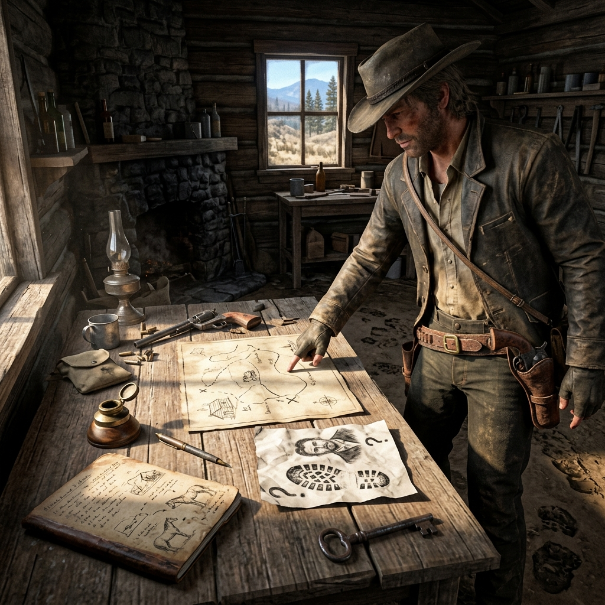

## The Locked Assay Office

> *Walk with me through one scene, start to finish. I will show you how the questions work, how the answers land, and what you write down when the dust settles. By the end, you will have played a full vignette and learned the procedure by doing it.*

---

It is Tuesday morning in French Gulch. Your character — let us call her Mae Sutter, a boardinghouse cook who keeps her ears open and her opinions quiet — is walking past the assay office on her way to the general store. The assay office should be open by now. The door is shut and the shade is drawn.

You have your first question.

---

**Step One: Frame the question.**

Keep it specific. Keep it answerable with Yes or No.

*"Is the assay office locked?"*

**Roll:** 8 — **Yes, but...**

The office is locked, but the back window is cracked open about two inches. Somebody is inside, or somebody left in a hurry without latching it. Write in your ledger:

> **Fact:** Assay office locked. Back window cracked open two inches.

---

**Step Two: Follow the thread.**

Mae is not the kind to walk away from a shut door when it ought to be open. She goes around to the side of the building and looks through the cracked window. You ask:

*"Can Mae see anyone inside the office?"*

**Roll:** 4 — **No.**

Nobody visible. The office is empty, or whoever is inside is not standing where the window shows. Write:

> **Fact:** No one visible inside the assay office through the back window.

---

**Step Three: Push or pull back.**

Mae could walk away. The office is locked, nobody is visible, and she has flour to buy. But the drawn shade bothers her. The assayer, Tom Greavy, always opens his shade at seven sharp. It is past eight. You ask a chipping question:

*"Is there anything unusual visible on the assayer's desk?"*

**Roll:** 11 — **Yes.**

There is something on the desk. You decide what it is based on what fits the fiction. Tom Greavy weighs ore samples and writes receipts. A strongbox would be normal. But today, the strongbox is open and empty, and there are papers scattered on the floor beside the desk — loose pages from his receipt book. Write:

> **Fact:** Strongbox open and empty on desk. Receipt book pages scattered on the floor.

---

**Step Four: The cutting question.**

Now the scene has weight. A locked office, an open strongbox, scattered papers, and no assayer. Mae has a choice: walk away and tell someone, or try the window. But first, a cutting question — the kind that changes the shape of the story:

*"Has Tom Greavy been robbed?"*

**Roll:** 6 — **No, but...**

He has not been robbed. But the strongbox is empty because Tom emptied it himself — sometime before dawn, based on the cold stove and the unlit lamp. He took whatever was in that box and left. The scattered papers are not from a struggle; they are from a man pulling receipts in a hurry, looking for specific ones. Write:

> **Fact:** Tom Greavy emptied the strongbox himself and left before dawn. He was pulling specific receipts.

---

**Step Five: Close the scene.**

The question that opened this scene — *Why is the assay office locked?* — has been answered. Tom Greavy is gone, by his own choice, with the contents of his strongbox and a handful of specific receipts. The scene has produced four facts and one clear thread:

> **Thread:** Where did Tom Greavy go, and what was in the strongbox?

Write the thread in your ledger. Mark it open. Fade out on Mae standing at the cracked window, flour forgotten, watching the empty desk and the cold stove.

---

**Wrap-Up**

In five questions, you built a scene from nothing — a locked door became a disappearance became a mystery. Each question was grounded in what Mae could see and do. Each answer was interpreted honestly, even when "No, but..." pointed away from the obvious. The facts accumulated in the ledger, and the thread emerged on its own.

That is the Questioning procedure. It works the same whether you are alone at the table or passing the guide's seat around a group. Ask the question. Roll the dice. Read the answer. Write the fact. Follow the thread.

### Margin Mark

*Written sideways in the ledger margin: "Greavy's stove was cold. That was the detail that told me everything."*
