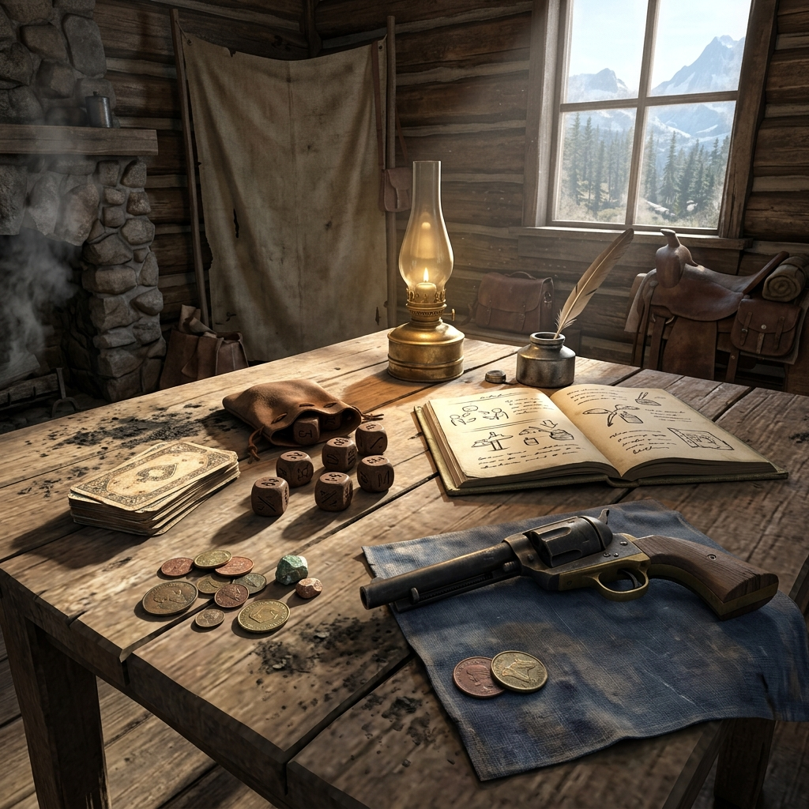

## Questioning

> *Out here, every question you ask the land is a gamble. The creek answers in gold or in mud. The road answers in hoofprints or silence. You learn to read what comes back and make your peace with it.*

Questioning is the beating heart of play. When the fiction reaches a fork — when what happens next is genuinely uncertain — you put a question to the oracle and let the answer reshape the trail ahead. This is not about luck. It is about reading the signs honestly and letting the frontier surprise you.

**How to ask.** Frame your question so it can be answered with Yes or No. Keep it specific and grounded in the scene. Not *"Does something interesting happen?"* but *"Is the assay office locked when I arrive after dark?"* The sharper the question, the more useful the answer.

**How to answer.** Roll two six-sided dice or draw two playing cards (use face value, aces low, face cards count as ten). Compare the total to the table below:

| Roll / Total | Result          | What It Means                                                    |
|--------------|-----------------|------------------------------------------------------------------|
| 2–3          | No, and...      | The answer is no, and something else goes wrong besides.         |
| 4–5          | No              | The answer is no. Plain and clear.                               |
| 6–7          | No, but...      | The answer is no, but there is a small opening or consolation.   |
| 8–9          | Yes, but...     | The answer is yes, but there is a cost, a complication, or a catch.|
| 10–11        | Yes             | The answer is yes. Plain and clear.                              |
| 12           | Yes, and...     | The answer is yes, and something else breaks in your favor too.  |

If you are using playing cards, draw two and add their values. Reshuffle when the deck runs thin or when the fiction demands a fresh shuffle — a new day, a new town, a new crisis.

**The Pressure Count.** Every time you roll a plain "No" or "No, and..." the pressure count rises by one. Track it with a tick mark in the margin of your ledger. When the pressure count reaches five, the next scene must open with a surge — an uninvited complication that arrives whether you asked for it or not. A debt collector at the door. A fire on the ridge. A letter from the county seat that changes everything. After the surge, reset the count to zero.

The pressure count keeps the frontier from going quiet. It ensures that even a string of bad luck builds toward something worth playing.

### Narrative Momentum

A question answered is a step taken. After every answer, write down one fact that the answer established — even if it is small. *The office was locked. The rider did not arrive. The creek ran clear.* These facts accumulate in your ledger and become the ground the story stands on. Without them, the frontier is just noise.

If three questions in a row produce results that feel flat or disconnected, stop and reframe. You are likely asking questions that are too distant from the scene. Pull closer. Ask about what is in front of your character right now — the smell of the room, the look on the clerk's face, the sound coming from the back of the saloon.

### Probabilities and Being Fair

The table above is weighted toward the middle. Most answers will land on "Yes, but..." or "No, but..." — the complicated middle ground where the frontier actually lives. That is by design. Out here, nothing is clean. Every yes has a price and every no has a crack in it.

Do not adjust the probabilities to favor your character. The oracle is honest even when you are not. If the question is about something your character is particularly skilled at, you may shift one step up the table — a "No" becomes a "No, but..." and a "Yes, but..." becomes a "Yes." This is the only permitted adjustment, and it should be used sparingly. The frontier does not care how good you are at your trade.

### Follow-Up Facts

Every "And..." result — whether yes or no — generates a follow-up fact. This is a new piece of information that the answer drags into the light. It should connect to the current scene but point outward toward something else. *Yes, the office is open, and there is a ledger sitting on the counter that does not belong to the assayer.* Write the follow-up fact in your ledger and underline it. It is now a seed for a future thread.

Follow-up facts are how the frontier grows. They are not planned. They are not scripted. They arrive because the oracle said "and..." and you had the honesty to describe what that means.

### Chipping Questions and Cutting Questions

A **chipping question** is small and careful. It chips at the edges of a situation. *Is the door locked? Is anyone watching the road? Did the rain wash out the trail?* Chipping questions are safe. They cost nothing but time.

A **cutting question** goes straight to the bone. *Did he kill the rider? Is the company bankrupt? Has the bridge been sabotaged?* Cutting questions are dangerous because the answer — whatever it is — changes the shape of the story permanently. Before you ask a cutting question, make sure you are ready for either answer. The frontier does not let you take back what you have learned.

Use chipping questions to build the scene. Use cutting questions to break it open.

### Player vs. Storyteller

In solo play, you wear both hats — the one who asks and the one who answers. The oracle keeps you honest, but interpretation is still yours. When you interpret a result, favor the answer that makes the story harder, not easier. The frontier is not generous, and your story should not be either.

In group play, the guide interprets oracle results, but any player may argue for a different reading if they can ground it in the established facts. Disagreements are settled by drawing one more card: high card means the guide's interpretation stands, low card means the table's alternative wins. Either way, the answer is final. No appeals, no second draws.

### Unexpectedly Explanations

Sometimes the oracle gives you an answer that does not make sense. The door is unlocked in a building that should be sealed. The rider arrived even though the bridge is out. When this happens, do not ignore the answer. Instead, explain it. *The door is unlocked because someone has already been here. The rider arrived because he swam the creek and nearly died doing it.*

The unexpected is where the frontier lives. An answer that does not fit is an invitation to discover why it does not fit — and that discovery is almost always more interesting than the answer you expected.

When you explain the unexpected, write the explanation in your ledger as a new fact. It is now true. The frontier just told you something you did not know, and you owe it the respect of writing it down.

### Margin Mark

*Scrawled in faded ink beside a tally of five marks: "Asked the creek. Creek said no. Asked again. Creek said no louder."*
