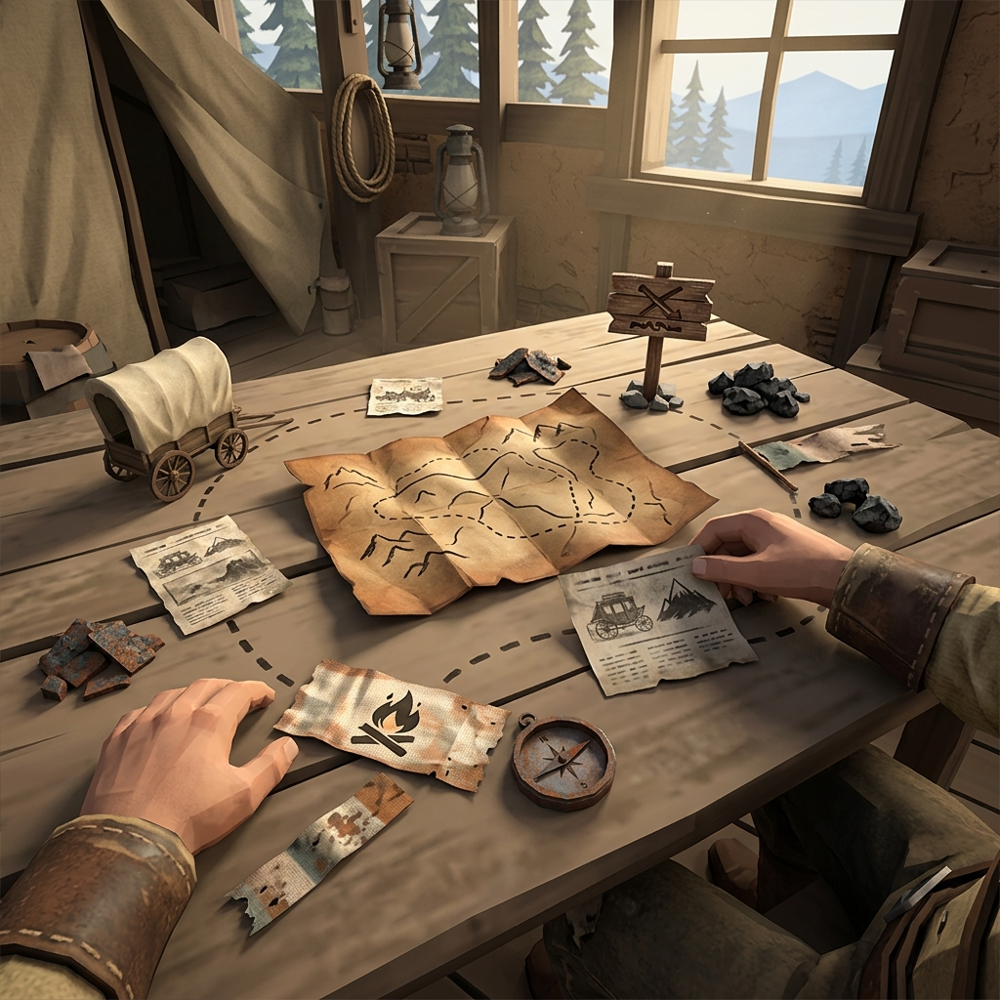

## Storyspinning

> *A good spinner does not invent the thread. She finds it already hanging from the loom — a loose end left by the last question — and pulls it until the pattern shows itself.*

Storyspinning is the art of turning facts into consequences and consequences into new questions. It is not plotting. It is not planning three sessions ahead. It is the practiced habit of looking at what you have written in the ledger and asking: *What does this mean? What happens because of it? Who else cares?*

The frontier does the spinning for you, if you let it. Every fact you record is a fiber. Every thread you follow is a line. Storyspinning is just the act of noticing where the lines cross.

### Stories from Threads

A story is what happens when two or more threads pull against each other. The missing payroll is one thread. The foreman's silence is another. The assayer's disappearance is a third. When those threads tangle — when the foreman's silence turns out to be connected to the assayer's empty strongbox — a story is born. You did not plan it. You followed the questions honestly, and the frontier wove the pattern.

To spin a story from threads:

1. Look at your open threads. Find two that could be connected — not must be, but could be.
2. Ask a question that bridges them. *"Did Tom Greavy leave French Gulch because of the missing payroll?"*
3. Let the oracle answer. If yes, the threads are now tangled. If no, they remain separate — for now.
4. Write the new fact and follow where it leads.

Stories grow from the bottom up, not the top down. Do not plan your ending. Let the threads tell you where the trail goes.

### Hooks

A hook is a fact that demands attention. Not every fact is a hook — some are just scenery. But a fact becomes a hook when it points at an unanswered question or an unresolved tension.

**A fact:** *The bridge planks were pulled and stacked on the far bank.*
**The hook:** *Who pulled them, and why do they want the crossing closed?*

**A fact:** *The company posted a notice: no credit for drinkers.*
**The hook:** *What happens to the miners who were already in debt at the store?*

**A fact:** *A sealed letter arrived from the county seat for the assayer.*
**The hook:** *The assayer ran before he opened it. What does the letter say?*

Hooks are how the frontier keeps itself interesting. Every session, look at your ledger and circle the facts that have hooks dangling from them. Those are your entry points for the next scene. If you have no hooks, draw a rumor card — the frontier always has something to say.

### From Fact to Consequence

Every fact has a consequence, and every consequence is a new fact. This is the engine of play. The trick is learning to follow the chain without forcing it.

When you record a fact, ask yourself three questions:

1. **Who else knows?** If the assayer left town, who noticed? The company? The boardinghouse keeper? The miners waiting for their ore receipts? Whoever else knows has a stake, and a stake means a thread.
2. **What changes because of it?** If the bridge is closed, who cannot get to town? What deliveries stop? What debts go unpaid? Consequences ripple outward from French Gulch like water from a thrown stone.
3. **What gets worse if nothing is done?** The frontier does not wait. If the payroll stays missing, the miners do not get paid. If the miners do not get paid, the saloon goes dry and the boardinghouse starts turning people out. If you do nothing, the frontier does something on its own — and it is rarely kind.

Write the consequences in your ledger as new facts. Each one is a potential thread, a potential scene, a potential story. You will not follow them all. That is fine. The frontier is bigger than any one person can ride, and the threads you leave behind are the ones that make the world feel alive.

### Margin Mark

*Penciled beneath a tangle of crossed-out lines: "Three facts. Two hooks. One story I did not see coming."*
