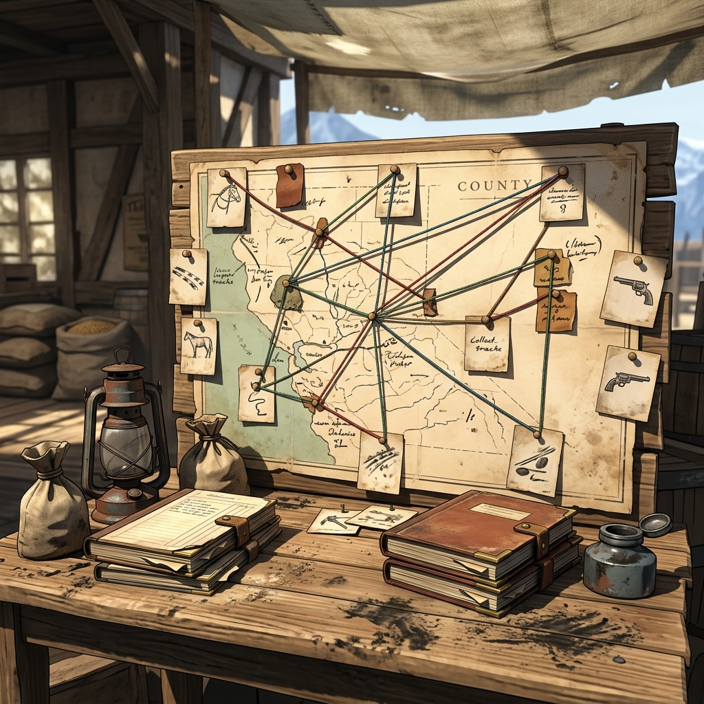

## Threads and Scenes

> *A thread is a string pinned to the county map. A scene is the ground you stand on when you follow it. Between them, they are all the structure the frontier needs.*

### Threads

A thread is an unanswered question that pulls the story forward. It is not a plot — it is a line of tension. *Where did the assayer go? Who filed the false claim? Why has the company stopped paying?* Threads are born from play. They emerge from oracle answers, from facts written in the ledger, and from the friction between characters and the world.

Write each thread as a question in your ledger. Keep it sharp. A thread that reads *"Something is wrong in town"* is too vague to follow. A thread that reads *"Who sent the sealed letter to the assay office?"* gives you a direction to ride.

Threads stay open until the fiction closes them. Some threads close in a single scene. Others wind through half a dozen sessions before the answer comes clear. A thread that goes cold is not dead — it is waiting. Mark it with a dash in the margin and come back to it when the frontier nudges you that direction.

### Scenes

A scene is a unit of play. It has a place, a time, a question, and at least one character present. Scenes begin when you say they begin and end when the question that opened them has been answered — or when a bigger question has taken its place.

Every scene should be short enough to hold in your hand. If a scene sprawls past six or seven questions without finding its point, it has gone on too long. Fade out, mark what you know, and open a new scene closer to the trouble.

### Stage of the Scene

Every scene passes through stages, like water through a sluice. You do not need to announce the stage — just know where you are so you can feel when the current shifts.

#### To Knowledge

The scene opens with gaps. You do not know what is behind the door, who is waiting at the ford, or what the letter says. Questions in this stage are chipping questions — small, careful, circling the edges. You are gathering facts.

#### To Conflict

Knowledge reveals friction. Two interests collide — your character's need against the company's grip, one person's word against another's claim, the weather against the road. Questions in this stage are sharper. You are making choices that have costs.

#### To Endings

The conflict resolves, or it transforms into something new. The scene reaches its hinge — the moment where the answer changes what comes next. Questions here are cutting questions. The answer is final, and the thread either closes or splits into two.

### Scene Setup

Before you open a scene, write three things:

1. **Where.** Name the place. Be specific — not "town" but "the front porch of the company store" or "the ford below the Deadwood claim."
2. **When.** Time of day and weather. These shape what your character can see, hear, and do.
3. **Why.** What question or thread brought you here? This is the scene's engine. Without it, the scene has no direction.

If you cannot answer all three, you are not ready to open the scene. Wait until you can.

### Fade In

Begin the scene with a single sentence of description. Not a paragraph — one sentence that drops you into the place and the moment. *"Rain on the tin roof of the assay office, and the door standing open."* That is enough. The rest comes from questions.

### Fade Out

End the scene when the question is answered or when a new question has grown too large to ignore. Do not drag a scene past its natural close. Say *"Fade out"* or simply stop asking questions and write your summary.

When you fade out, write down:

- **Facts learned.** Every confirmed detail from the scene.
- **Threads opened or closed.** Did you answer the question you came with? Did a new thread appear?
- **Pressure count.** Update it based on oracle results.

### Point of Origin

Every story in the frontier has a point of origin — the place and moment where the first thread was pulled. In most cases, this is French Gulch. The company store, the boardinghouse, the assay office, the creek claims — these are the starting pressure points. Threads may lead you to Redding, to the county seat, to the high ridges or the river towns, but they begin here. When a thread goes cold or the story feels directionless, come back to the point of origin. There is always something happening in French Gulch.

### Main and Non-Main Threads

At any time, you should have one **main thread** — the question that is driving the story forward with the most force. This is the thread you follow when you are not sure what to do next.

All other open threads are **non-main threads.** They are not less important — they are less urgent. Non-main threads give the frontier its texture. They are the debts that come due at inconvenient times, the rumors that turn out to be half-true, the people who show up when you least expect them.

Mark your main thread with a star in the ledger. When the main thread closes, promote a non-main thread to take its place. If none of your non-main threads feel strong enough to drive the story, it is time to draw a new rumor card and let the frontier hand you a fresh question.

### Other Notes on Threads

- A thread can split. *"Who took the payroll?"* might become *"Why did the foreman lie about it?"* and *"Where is the satchel now?"* Both are valid threads. Write them both down.
- A thread can merge. Two threads that seemed separate may point to the same answer. When that happens, combine them in the ledger and follow the stronger question.
- A dead thread is not a failure. Some questions do not have answers, or their answers do not matter anymore. Cross them out with a single line — do not erase them. The frontier remembers what you asked, even when the answer never came.

### One Rule

Every scene must produce at least one new fact. If you fade out of a scene with nothing written in the ledger, the scene did not earn its place. Go back and ask one more question, or describe one detail you overlooked. The frontier does not give you empty ground — there is always something to find if you are willing to look.

### Margin Mark

*Pinned to the corner of the county map with a tack: "Three threads open. One pointing north. Follow that one first."*
