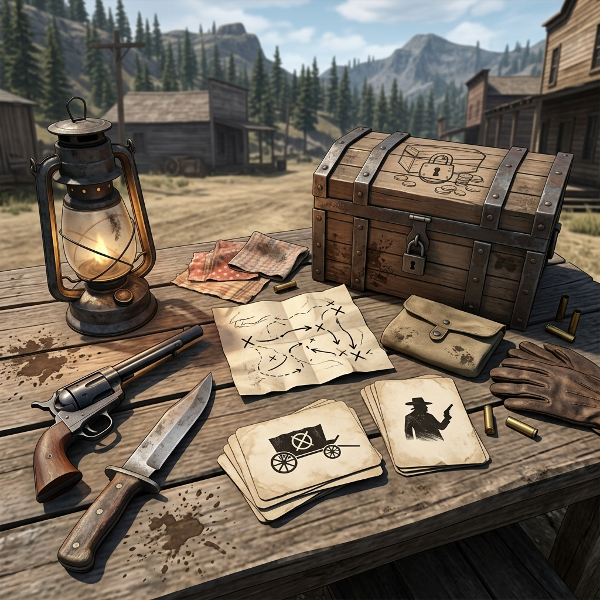

## Vignette Tutorial: "The Empty Satchel"

> "Sometimes the quiet moments on the trail tell you more than a shout in a crowded saloon."

A vignette is a short, focused scene to resolve a single question or take a minor action without dragging the whole camp into a long drawn-out affair. Here is how a vignette flows when you realize the camp's provisions have been tampered with.

**Setup**  
Establish the moment in clear, physical terms. "It's first light outside French Gulch. I'm making coffee and open the supply satchel to get the hardtack, only to find the bottom slashed open and the flour gone."

**Question**  
Focus on the immediate uncertainty. Ask the table or the oracle: "Did an animal get into this, or was it a person with a blade?" 

**Interpretation**  
You draw a card or roll the bone to determine the nature of the event. The result indicates human interference, executed quickly. You interpret this within the fiction: "The cut is clean, made by a sharp knife, not teeth or claws. Someone snuck into camp while we slept."

**Consequence**  
Every vignette must change the state of the board. You mark a loss in the ledger under **Supplies**: *Flour is gone, rations are short.* But you also gain a clue. You state: "I find a footprint in the soft dirt near the satchel, leading toward the creek." You add a new thread to the ledger.

**Close**  
The vignette ends quickly so play can return to the wider group. You state your immediate reaction to tie it off. "I pour the coffee, wake the others, and point at the slashed satchel. 'We're being followed.'" The scene closes, and the group now has to decide their next move.

### Margin Mark

A quick sketch of a boot print next to the supply tally. It's a visual reminder to the group that the missing food isn't just bad luck—it's a threat trailing right behind them.
